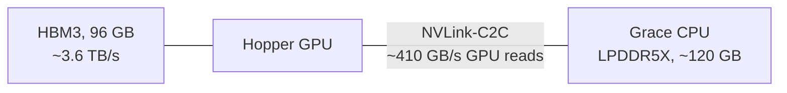
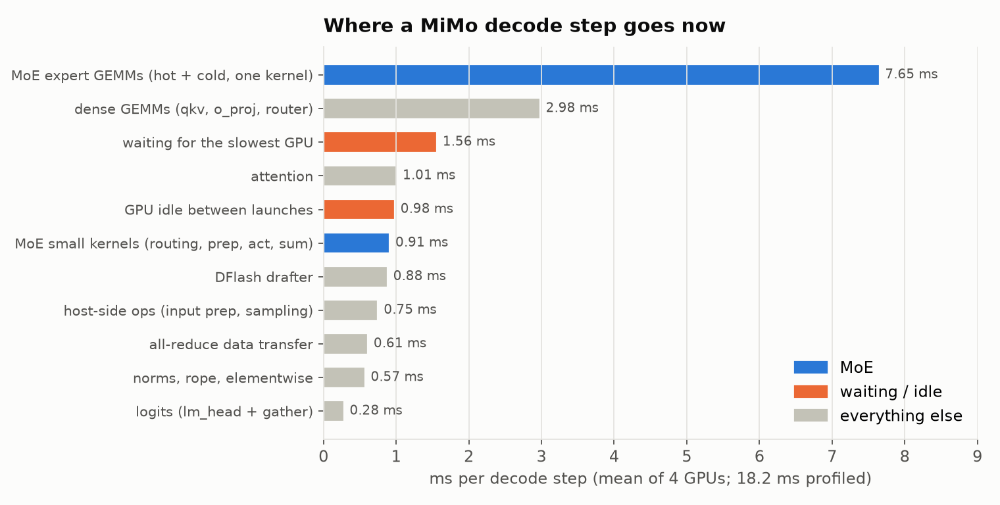

# Tiered MoE on GH200: serving MoE models bigger than HBM

A GH200 GPU can read its CPU's memory directly, at about a ninth of HBM speed.
This is how we use that to serve mixture-of-experts models that don't fit in
HBM, on one 4x GH200 node with vLLM:
- keep the experts that actually get used in HBM, leave the rest in CPU memory;
- have the GPU read both at the same time, so the slow part hides behind the
  fast one;
- keep the four GPUs from waiting on each other.

| model | where we started | now |
| --- | ---: | ---: |
| GLM-5.2 W4A16 (361 GiB), 400K context | 38 tok/s (stock vLLM offload) | **128 tok/s** |
| MiMo-V2.6-Pro, 250K context | 34.7 ms/step, ~110 tok/s (first tiered version) | **17.1 ms/step, ~198 tok/s** |

Both at batch one with speculative decoding. GSM8K doesn't move.

**GLM-5.3** is in progress on the same node, one user, 7 draft tokens, 400K context. On
the same agentic coding tasks and harness as MiMo it decodes at 28.1 ms/step
(~124 tok/s) against MiMo's 16.9 (~201), at matched acceptance. With a DFlash2
drafter, now working under DCP4, and a round of kernel work on the verify step
(same outputs), plus a fused all-reduce/RMSNorm, it is at ~24.0 ms/step
(~144 tok/s). Freeing HBM for hot experts (+496 per GPU, mostly by moving memory to Grace) and
a round of decode micro-optimizations take it to **~21.0 ms/step (~168 tok/s)**
for one user; with up to 32 tokens per decode step it serves 4 users at ~330
tok/s and 8 at ~440, each with 400K of context on a shared KV pool:
[glm/README.md](glm/README.md) tracks what was different, what it took, and
where the gap is.

## The hardware

A GPU kernel can read Grace memory in place: no copy, no page fault. That gives
each GPU ~120 GB more memory at 1/9 of HBM's speed. Every number here was
measured on our node, not taken from spec sheets.

## The problem

- **GLM-5.2 W4A16** has 361 GiB of weights. The node has 4 x 96 GiB of HBM,
  before any KV cache.
- **MiMo-V2.6-Pro** puts 6,624 experts on each GPU: 123.7 GiB of expert weights.
  That GPU's 95 GiB of HBM also holds attention weights, a 250K-token KV cache
  and a speculative drafter.

So 35–50% of the experts have to live in Grace. MoE makes that workable,
because each step only uses a few experts per layer. The question is how much
the Grace part costs.

Stock vLLM's `--cpu-offload-gb` answers "a lot". It moves whole layers to
pinned host memory, busy experts and idle ones alike. While a Grace-resident
layer runs, HBM sits idle, so every byte from Grace is added to the step time.

## The idea: two tiers, read at the same time

Split each MoE layer's experts into **hot** (in HBM) and **cold** (in Grace).
When a layer runs, read the active hot experts from HBM and the active cold ones
from Grace **at the same time**. The layer then costs `max(hot, cold)` instead
of `hot + cold`.

If the two run one after the other, a byte from Grace costs nine times a byte
from HBM. If they overlap, Grace reads hide under HBM reads until both take
equally long. That happens when ~16% of a step's expert bytes come from Grace.
Up to that point, offloading is nearly free.

Everything below either makes that overlap real, keeps the Grace share near
16%, or removes what was left around it.

## 1. Making the two tiers actually overlap

The first version ran the hot and cold kernels (vLLM's Marlin) on two streams
and still decoded at stock-offload speed. The kernels were barely overlapping.

**The cause was a shared-memory request.** Marlin sizes its launch so that each
SM fits exactly N blocks, and asks for `228 KiB / N` of shared memory per block,
whatever it really uses (about 25 KiB). At 3 blocks per SM the hot kernel claims
224 of 228 KiB on every SM, so the cold kernel's blocks can't start until hot
blocks finish.

**The fix:** ask for the shared memory the kernel actually uses, and size the
grids explicitly: hot at 2 blocks per SM, cold at 1, both spread over all 132
SMs. Now every SM runs blocks of both kernels, one reading HBM and the other
Grace.

Across 15 realistic hot/cold mixes, a layer gets 15–40% faster (median −34%),
and most land within a few µs of `max(hot, cold)`. On GLM that took the step
7.7% faster.

A few things we checked along the way:
- **HBM and Grace traffic don't slow each other down.** Both running at full
  speed on the same SMs finish within 0.1% of the slower one alone.
- **The cold kernel saturates the link**, at 88–95% of C2C bandwidth.
- **Giving each tier its own SMs is worse** (green contexts: 9–40% slower). The
  cold tier needs many SMs to keep enough reads in flight.

The GLM story: blue bars are offload work, grey bars are a MoE communication fix
and MTP speculative decoding.

## 2. Putting the right experts in HBM

Once the tiers overlap, the goal is to keep the cold share of each step near
16%. Routing is skewed: some experts get ~8x a fair share, and the least-used
~50 per layer are almost never picked. So we record which experts the router
picks on real agentic-coding sessions and fill HBM with the most-used ones.

On task types the ranking never saw, with the most-used half in HBM, 80% of
routed tokens never touch Grace. With an arbitrary half it's 50%.

MiMo had been running with an arbitrary hot set: 42% of each step's expert
reads came from Grace, far past 16%. With the profile it's 17%, and the decode
step drops from 34.7 to 25.0 ms.

Servers were restarted for every run, in both orders, on three nodes, with
decode prompts that weren't in the capture. Every run landed within 0.3 ms of
its group's mean.

## 3. One kernel that reads both tiers

Marlin is built for larger batches than a decode step. It pads our 8 tokens to
16 rows, uses a fixed grid, and each tier pays for its own helper kernels. The
hot tier ran at about half of HBM bandwidth.

So we wrote one decode kernel, specific to MiMo's shapes, that handles both
tiers in a single launch:
- **Split by SM.** The first 16–24 blocks stream cold experts from Grace, which
  is enough to saturate the link. The rest stream hot experts from HBM. In each
  block, one warp issues TMA copies into a 4-stage shared-memory ring and eight
  warps do the math.
- **No padding.** Weights go on the 16-row side of the tensor-core op and the
  ≤ 8 tokens on the 8-wide side.
- **Even split.** Every block gets an equal slice of its tier's work, down to
  parts of an expert, and partial sums meet through fp32 atomics.
- **Marlin's tensors, read in place.** Loading, memory and prefill don't change.
  Marlin's 4-bit words turn into exact fp16 with a few bit operations.
- **Lossless.** Products are exact and sums are fp32. The error against fp32 is
  lower than Marlin's, because nothing in between is rounded to bf16.

Per layer it is 1.25–1.32x faster than the two Marlin launches when hot experts
dominate, and 1.06–1.12x when 2–3 cold experts make the link the limit. End to
end, the decode step goes from 20.2 to 18.4 ms (−9%).

Two things we learned building it:
- **The GPU is power-capped.** Under sustained MoE load it settles near 1.4 GHz,
  not its 1.98 GHz boost, so short benchmarks mislead. We tuned at a pinned
  clock the chip can hold.
- **Cheaper math didn't pay.** FP8 bought nothing here, and its tensor-core
  accumulation loses precision. Accumulating in fp16 was faster but changed
  about 13% of outputs, so we dropped it.

It sits behind a flag (`VLLM_TIERED_MOE_DECODE_KERNEL=1`) and only runs decode
steps. Everything else still uses Marlin.

## 4. Keeping the four GPUs in step

Each GPU owns a quarter of every layer's experts. After each MoE layer, all
four meet in a collective, and it can only finish when the last GPU arrives.

This is one real layer. GPUs 1 and 2 drew a lot of cold work, GPU 3 almost none,
so GPU 3 sits in the collective for ~150 µs doing nothing. Which GPU is last
changes from layer to layer: this is routing luck, not a slow GPU. Before any of
the fixes below, it cost ~5 ms per step. Three changes attack it.

**Every GPU routes every token.** MiMo's MoE used to split the tokens across
GPUs and swap results in three collectives per layer. Routing all tokens on
every GPU leaves one collective per layer. That alone cut the step by 13%. It
also means all four GPUs see the same routing for every token, which the next
two changes rely on.

**Spare copies of busy experts.** Each GPU keeps copies of 1,500 of the other
GPUs' cold experts in its own Grace memory (28 GiB per GPU). When a GPU draws
too many cold experts, some of them run from a copy on another GPU instead.
Every GPU works out the same choice from the same routing, so they agree without
talking to each other. Which experts to copy is chosen offline from routing
traces.

Here GPU 0 drew 5 of the layer's 11 active cold experts. With copies, GPUs 1 and
3 each take one, and the layer waits for 3 cold experts instead of 5. That's
−5.3% per step.

**Balancing time, not counts, inside the kernel.** The first version balanced
how many cold experts each GPU got. But a GPU's time isn't its cold count: a hot
expert costs ~8 µs and a cold one ~50 µs, and hot experts can't move. We
measured our kernel's time for every mix of 0–24 hot and 0–6 cold experts,
built that table into it, and now move copies to balance predicted time.

The choice used to be a separate small kernel that took 14 µs per layer, 69
times a step. It now runs inside the kernel's first stage, on one warp, and adds
1.5 µs. Together, this took **−5.6% off the step** (18.2 → 17.1 ms, alternating
runs on one node). Waiting in the collective fell from 1.64 to 1.40 ms per step,
which is what a replay of held-out routing traces had predicted.

What's left of the waiting comes from hot experts. They have no copies, so they
can't move.

## 5. Prefill is different

A prefill chunk is 8K tokens, so every cold expert gets used many times. The
GPU's L2 cache doesn't hold Grace memory, so reading cold experts in place means
streaming the same weights over the link again and again.

So prefill uses standard layer-ahead (L+1) prefetching: while layer L computes,
layer L+1's cold experts are copied host-to-device into a spare HBM slot. It
works here because a big batch makes each layer's compute long enough to hide
the copy completely. That cuts time to first token by 17–23% on MiMo. Decode
steps are far too short to hide a copy, so decode keeps reading in place.

## 6. Outside the MoE: sampling

Chat requests sample at temperature 1 with top-p 0.95. When checking 7 drafted
tokens, vLLM applied top-p by sorting all 152K vocabulary entries: a sort, a
cumulative sum and a scatter, ~450 µs per step. FlashInfer finds the cutoff
without sorting (it only differs on exact ties at the edge). That's −0.32 ms per step at temperature 1, and doesn't affect
greedy decoding.

## The result on MiMo

MiMo-V2.6-Pro on one 4x GH200 node: 250K context, batch one, DFlash speculative
decoding (8 tokens checked per step). The bars follow the order the changes were
made. Each was measured against its own control, with servers restarted per run.

| | decode step | decode speed | GSM8K |
| --- | ---: | ---: | ---: |
| arbitrary hot set | 34.7 ms | ~110 tok/s | 90.2–91.5% |
| + hot set from routing traces | 25.0 ms | ~147 tok/s | 90.0–90.7% |
| + every GPU routes all tokens | 21.8 ms | ~165 tok/s | 89.7–91.0% |
| + copies of busy experts | 20.7 ms | ~178 tok/s | 91.0% |
| + one kernel for both tiers | 18.4 ms | ~187 tok/s | 89.5–90.5% |
| + balance GPUs by time | **17.1 ms** | **~198 tok/s** | 90.0–92.0% |

- **Step time is the stable number.** Tokens per second also depends on how
  many drafted tokens get accepted, which moves ±5% between identical runs.
- **GSM8K** used 400 questions per run, 200 in the last row.
- **Prefill** stays flat throughout (TTFT 4.0 / 16.9 / 40.2 s at 32K / 128K /
  240K). The later changes only touch decode.

## Where a step goes now

A profile of the current build (with the old sampler) on the same prompts:
- **The expert GEMMs are the biggest item.** 7.7 ms, against ~6 ms if every
  byte moved at full HBM and link speed.
- **GPUs still wait for each other: ~1.4 ms.** It's all hot-expert imbalance, so
  closing it means giving hot experts copies too.
- **~1 ms of the GPU sitting idle.** Around ~240 small ops run one launch at a
  time outside the CUDA graphs, with a few µs of nothing between each. The
  worst stretch is the per-step input prep before the verify pass (~0.26 ms).
  Removing it means building those inputs on the GPU.

## What each piece bought

Each result is against its own matched control.

| change | effect |
| --- | --- |
| hot/cold overlap on two streams | +18% decode tok/s (GLM) |
| Marlin shared-memory fix, tiers truly side by side | −34% per MoE layer, −7.7% step (GLM) |
| hot set from routing traces | −28% decode step (MiMo) |
| every GPU routes all tokens | −13% decode step (MiMo) |
| copies of busy cold experts | −5.3% step (MiMo, batch one); −5 to −6.5% at 4 concurrent requests (GLM) |
| staging cold experts during prefill | −17 to −23% TTFT (MiMo) |
| one kernel for both tiers | −9% decode step (MiMo) |
| balancing GPUs by predicted time, in the kernel | −5.6% decode step (MiMo) |
| top-p without sorting the vocabulary | −0.32 ms per step at temperature 1 (MiMo) |

## What didn't work

- **Giving each tier its own SMs** (green contexts): 9–40% slower than sharing.
- **Fusing both halves of the expert math into one launch:** syncing inside the
  kernel cost more than the launch it saved. The same happened when we folded
  the final sum into the second GEMM.
- **fp16 accumulation and FP8 math:** faster or free in theory, but not lossless.
- **Sharding the drafter's input projection across GPUs:** it would save
  ~0.08 ms, too little to see end to end, so we reverted it.

## Things worth knowing

- **Offloading barely matters at one token per step.** There, Marlin reading
  from HBM is latency-bound (~10% of bandwidth), and Grace-resident experts run
  within a few percent of it. With speculative decoding or batching, a step uses
  ~45 of 384 experts per layer, the kernels become bandwidth-bound, and the 9x
  gap shows. That's when overlap and placement start paying.
- **Measure under CUDA graphs.** Timing the two streams eagerly added ~110 µs of
  stream sync per iteration, which hid the whole overlap win.
- **Profiles are traffic-specific.** Ours was recorded on coding. It holds up on
  coding tasks it never saw (15% vs 12% of routes to Grace), but chat, math and
  other languages are untested.
- **Pinned memory has sharp edges.** `pin_memory()` rounds allocations up to a
  power of two (a 1.01 GiB tensor pins 2 GiB), and pages pinned on the wrong NUMA
  node drop the link from ~410 to 70–80 GB/s without any error. We pin at exact
  size with `cudaHostRegister` on the GPU's own NUMA node.

## Where the data is

Everything above comes from the public worklog
([alint77/jupiter-glm52-vllm-worklog](https://github.com/alint77/jupiter-glm52-vllm-worklog)).
Each experiment folder holds its scripts, raw results and a README.

| topic | experiments |
| --- | --- |
| stock vLLM offload baseline, Grace bandwidth | [2026-07-17-native-baseline](https://github.com/alint77/jupiter-glm52-vllm-worklog/tree/main/experiments/2026-07-17-native-baseline), [2026-07-25-grace-bandwidth](https://github.com/alint77/jupiter-glm52-vllm-worklog/tree/main/experiments/2026-07-25-grace-bandwidth) |
| tier plan, storage, loading | [2026-07-17-tier-plan](https://github.com/alint77/jupiter-glm52-vllm-worklog/tree/main/experiments/2026-07-17-tier-plan), [2026-07-17-tiered-storage](https://github.com/alint77/jupiter-glm52-vllm-worklog/tree/main/experiments/2026-07-17-tiered-storage) |
| hot/cold overlap and the Marlin shared-memory fix | [2026-07-17-tiered-stream-overlap](https://github.com/alint77/jupiter-glm52-vllm-worklog/tree/main/experiments/2026-07-17-tiered-stream-overlap), [2026-07-25-tier-overlap](https://github.com/alint77/jupiter-glm52-vllm-worklog/tree/main/experiments/2026-07-25-tier-overlap), [2026-07-29-marlin-smem-monopoly](https://github.com/alint77/jupiter-glm52-vllm-worklog/tree/main/experiments/2026-07-29-marlin-smem-monopoly), [2026-08-01-marlin-tier-overlap](https://github.com/alint77/jupiter-glm52-vllm-worklog/tree/main/experiments/2026-08-01-marlin-tier-overlap) |
| giving each tier its own SMs (green contexts) | [2026-07-27-green-context-marlin](https://github.com/alint77/jupiter-glm52-vllm-worklog/tree/main/experiments/2026-07-27-green-context-marlin) |
| routing capture and the hot set (GLM, MiMo) | [2026-07-26-claude-routing-capture](https://github.com/alint77/jupiter-glm52-vllm-worklog/tree/main/experiments/2026-07-26-claude-routing-capture), [2026-09-26-mimo-routing-profile](https://github.com/alint77/jupiter-glm52-vllm-worklog/tree/main/experiments/2026-09-26-mimo-routing-profile) |
| copies of busy cold experts | [2026-07-31-replicated-expert-scheduling](https://github.com/alint77/jupiter-glm52-vllm-worklog/tree/main/experiments/2026-07-31-replicated-expert-scheduling), [2026-09-05-decode-placement-replicas](https://github.com/alint77/jupiter-glm52-vllm-worklog/tree/main/experiments/2026-09-05-decode-placement-replicas), [2026-09-26-mimo-routing-profile](https://github.com/alint77/jupiter-glm52-vllm-worklog/tree/main/experiments/2026-09-26-mimo-routing-profile) |
| one kernel for both tiers, balancing by time, the sampler | [2026-09-27-dak-tiered-moe-kernel](https://github.com/alint77/jupiter-glm52-vllm-worklog/tree/main/experiments/2026-09-27-dak-tiered-moe-kernel) |
| MiMo serving config and decode profiles | [2026-09-22-mimo-v26-pro](https://github.com/alint77/jupiter-glm52-vllm-worklog/tree/main/experiments/2026-09-22-mimo-v26-pro), [2026-09-26-mimo-decode-profile](https://github.com/alint77/jupiter-glm52-vllm-worklog/tree/main/experiments/2026-09-26-mimo-decode-profile) |
| prefill cold-expert staging | [2026-09-05-cold-prefetch](https://github.com/alint77/jupiter-glm52-vllm-worklog/tree/main/experiments/2026-09-05-cold-prefetch) |
