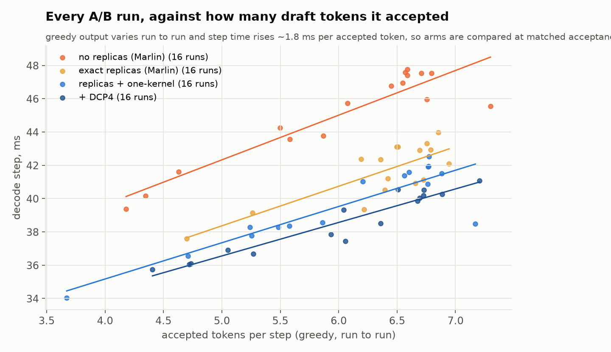
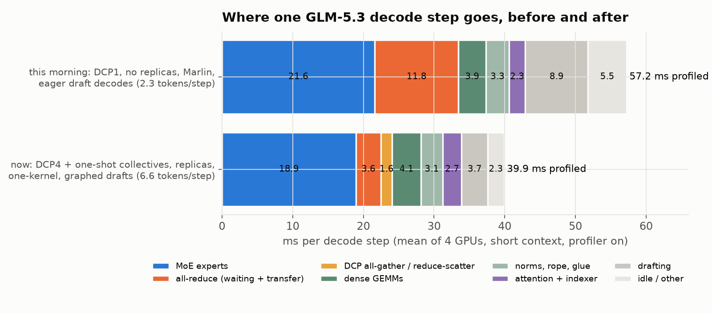

# GLM-5.3 on the tiered MoE path

A running log of serving **GLM-5.3 W4A16** on one 4x GH200 node, at the shape
we actually use: one user at a time, **MTP with 7 draft tokens** (so every
decode step verifies 8 tokens), **400K context**. The ideas are the ones in the
[main write-up](../README.md); this page is about what was different for GLM and
what it took. It gets updated as work lands.

| GLM-5.3, c=1, MTP7, 400K | decode step* | tok/s* |
| --- | ---: | ---: |
| where this round started | 46.6 ms | ~129 |
| now | **36.2 ms** | **~166** |

\*On a greedy bench at a matched 6 accepted tokens per step (see
[Measuring it](#measuring-it-acceptance-gets-in-the-way)). Real Claude-Code-style
traffic at temperature 1 accepts fewer tokens, so its tok/s is lower; the step
time saving carries over.

## How GLM differs from MiMo

- **It's natively bf16, so W4 is already an aggressive cut.** MiMo ships MXFP4;
  GLM-5.3 had to be quantized to int4 to fit at all. So nothing gets quantized
  further here: attention, the shared expert and the dense layers stay bf16.
- **Bigger experts, fewer of them in HBM.** 256 experts x 75 MoE layers; each
  int4 expert with its group-32 bf16 scales is 20.3 MiB. That's 4,800 experts
  per GPU, and at the start only ~48% of them fit in HBM (MiMo: ~57%).
- **Different attention.** MLA plus DeepSeek-style sparse attention: an indexer
  picks 2,048 past tokens per query and only those are read. At 400K context the
  KV cache is ~20 GiB per GPU when every GPU holds a full copy.
- **A shared expert** runs alongside the routed ones, in bf16.

## 1. Routing, and how much the HBM budget buys

GLM's routing is skewed but flatter than you might hope: the busiest expert in a
layer gets ~6x a uniform share, and the top half of experts takes ~81% of routes.

Ranked on some requests and measured on others, keeping each layer's most-used
experts in HBM serves 77% of routes at the starting budget and 91% once the
budget grows (section 4):

What a decode step actually pays for is **distinct cold experts**, since each
one read from Grace costs ~55 µs over NVLink-C2C. Per GPU per 8-token step:

Every ~300 extra hot experts per GPU saves roughly 2 ms per step. Two cheap wins
came straight from this:
- the HBM reserve was 10 GB, sized for an earlier drafter's KV cache; MTP doesn't
  need it, and 7 GB gives **+143 hot experts** per GPU;
- the prefill staging buffer (it copies the next layer's cold experts into HBM
  during prefill) was also sized for the replicas of section 2, which prefill
  never reads. Sizing it for a layer's own cold experts gave back 34 hot
  experts per GPU with 985 replicas, 88 with 2,000.

## 2. Keeping the four GPUs in step: replicas

After each MoE layer the four GPUs sync, so every layer costs as much as its
busiest GPU. With GLM's cold load that was the biggest single problem: **~8 ms of
every step was GPUs waiting** for the one with the most cold experts, and which
GPU that was changed from layer to layer.

The fix is the same as for MiMo: keep spare copies of busy cold experts in
another GPU's Grace memory, and at each step send an active cold expert to
whichever of its two holders is less busy. The production placement already had
985 copies per GPU, but they had never been switched on for GLM-5.3: an earlier
attempt ran out of memory. That turned out to be PyTorch's pinned-memory
allocator rounding every buffer up to a power of two (fixed during the MiMo
work), not a real shortage.

On held-out steps the busiest GPU's cold load drops from 128 above the average
to 49 above it. Measured: **-4.1 ms per step.** Going from 985 to 2,000 copies
only buys another ~0.5 ms, so we stayed at 985.

## 3. One kernel for both tiers, now for INT4

MiMo's decode MoE runs as one kernel that streams hot experts from HBM and cold
ones from Grace at the same time. GLM's experts have the same shape, so porting
it was just the weight format:
- int4 values decode exactly into f16 with one instruction per pair
  (`0x6400 | code`, then a fused multiply-add), landing on the same scale the
  MXFP4 path uses, so nothing downstream changed;
- the bf16 group scales sit in Marlin's layout, which conveniently puts the two
  scales a thread needs in one 32-bit word.

The kernel is more accurate than Marlin against an fp32 reference (error 3e-3 vs
6-7e-3 of the row max). **On its own it bought nothing end to end**: it does
~2 ms less MoE work per step, but that time just became waiting on the slowest
GPU. Once replicas were on, the kernel's other job paid off: it picks each
replica's GPU by predicted *time* rather than expert count. **-1.4 ms more.**

## 4. DCP4: sharding the KV cache across the GPUs

At one user, every GPU held a full copy of the 400K KV cache. With decode context
parallelism (DCP4) each GPU keeps a quarter of it. Two things improve:
- **~16 GiB per GPU freed**, which becomes ~780 more hot experts (2,427 -> ~3,210);
- **attention stops wasting work.** The FP8 sparse attention kernel only runs with
  64 or 128 query heads, so each GPU's 16 heads were padded to 64. Under DCP the
  queries are gathered across GPUs, so the kernel sees 64 real heads.

The catch is three small collectives per layer (gather queries, gather softmax
sums, scatter outputs), each ~7-12 µs through NCCL. They cost ~2.3 ms per step and
ate most of the gain: **-1.1 ms net** at first.

vLLM already has a fast path for small all-reduces: each GPU reads the others'
buffers directly over NVLink, between two cheap barriers, in one kernel. The same
trick works for a gather (copy instead of add) and a reduce-scatter (add only your
own slice), reusing that path's shared buffers and CUDA-graph bookkeeping. A query
gather dropped from 13.8 to 6.7 µs, and end to end the step got **3.1 ms faster**,
more than the collectives' own kernel time: NCCL was also leaving gaps between
kernels that are now gone. (vLLM's all-to-all variant of the combine measured
within noise; NCCL's symmetric-memory kernels broke CUDA graph capture here.)

## 5. The drafter was running uncaptured

MTP drafts in 7 passes: one over 8 tokens, then six over a single token each.
vLLM only builds a CUDA graph for the single-token passes if the capture sizes
include a size that fits one user, and ours listed only 8. So six of the seven
draft passes ran as ~430 separate kernel launches every step, silently. Capturing
size 1 as well fixed it: **-0.65 ms.** (The profiler had suggested ~5 ms; the CPU
was mostly launching ahead of the GPU anyway.)

## Measuring it: acceptance gets in the way

Each configuration is measured on the same prompts with greedy decoding, arms
alternated across two nodes. Two things make that harder than it sounds:
- greedy output isn't reproducible here, so the number of draft tokens accepted
  per step varies run to run;
- **step time rises with the number of accepted tokens**, even though the verify
  is always 8 tokens: a step whose 7 drafts are all accepted takes ~3.7 ms longer
  than one where none are. Logging every step shows it follows the *text* more
  than the step: stretches of predictable text accept well and also verify
  slower, most likely because 8 coherent tokens touch more distinct experts
  (and more cold ones) than a batch that's rejected early.

So every comparison is a fit at matched acceptance:

## Where a step goes now

The two captures happened to accept very different numbers of draft tokens (2.3
vs 6.6 per step), and a step whose drafts are mostly accepted is the slower kind
(see above), so the lower bar is the harder case and still comes in at 39.9 ms
against 57.2 (profiled; the profiler adds a few ms). The all-reduces, which are
mostly GPUs waiting on each other, fell from 11.8 to 3.6 ms, and the idle gaps
from 5.5 to 2.3. What's left, roughly in order:
- **the MoE itself** is now mostly the cold experts' C2C reads plus the hot tier;
- **dense GEMMs** at 8 tokens run at 40-78% of the HBM read floor, ~1.5 ms to gain:

  

- **DCP's collectives**, now ~1.6 ms;
- **the drafter**, ~3.8 ms; its biggest piece is reading the 155K-token output
  layer seven times, which is already at 93% of bandwidth;
- the acceptance-dependent cost above, which comes with the text rather than
  with any one kernel.

## Being worked on

- A bf16 kernel for the 8-token dense GEMMs. The production kernels take ~5.8 ms
  per step against a ~3 ms read floor. A first weight-streaming version is
  correct but slower than cuBLAS; it's being profiled.

## Accuracy

GSM8K, the same 1,000 questions on both setups: **91.2% now against 91.4%
before**, a difference of -0.2 points (95% interval -1.4 to +1.0). The two get
different questions right about equally often (18 vs 20), which is what noise
looks like.

## Where the data is

Raw data, scripts and every run: the worklog's
`experiments/2026-09-27-glm53-mtp7-profile` (figures from `plot_glm.py`,
A/B fits from `fit_ab.py`).
