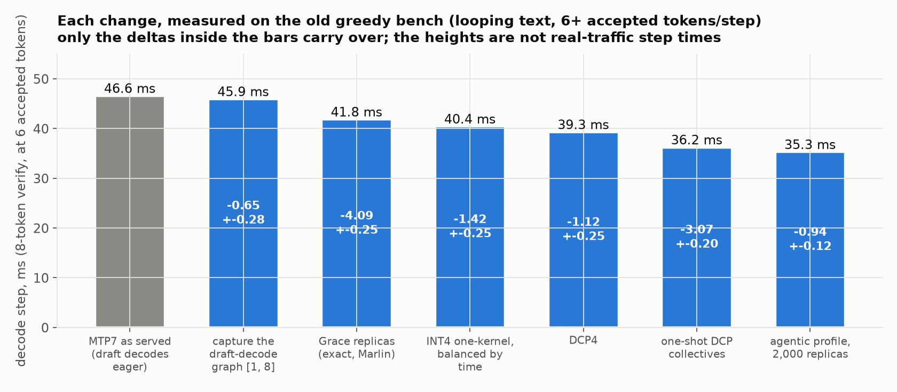
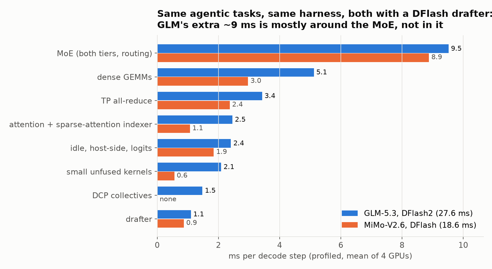
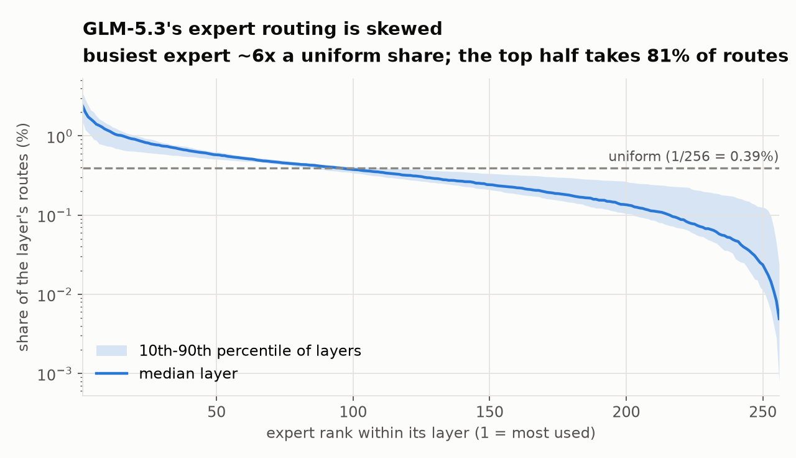
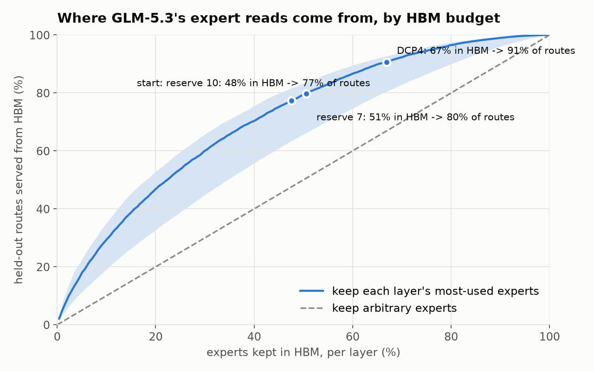
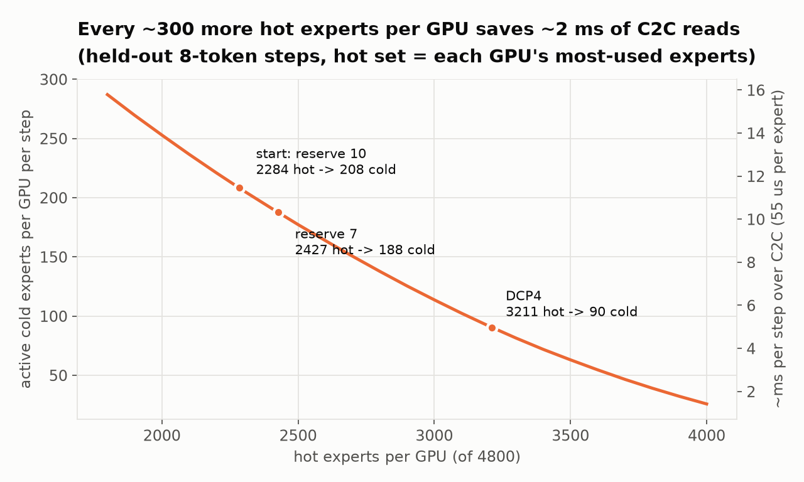
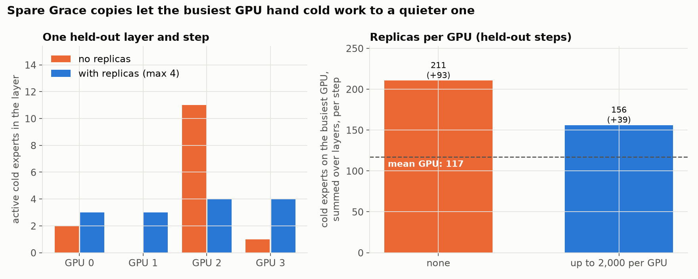
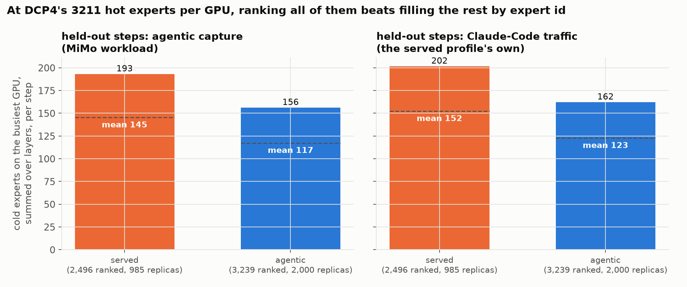
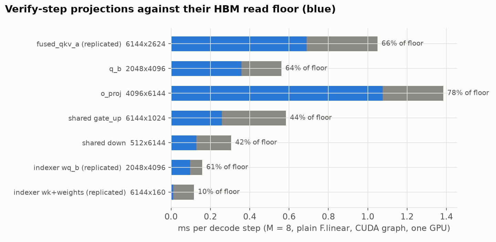

# GLM-5.3 on the tiered MoE path

A running log of serving **GLM-5.3 W4A16** on one 4x GH200 node, at the shape
we actually use: one user at a time, **MTP with 7 draft tokens** (so every
decode step verifies 8 tokens), **400K context**. The ideas are the ones in the
[main write-up](../README.md); this page is about what was different for GLM and
what it took. It gets updated as work lands.

Both models measured the same way, on the agentic coding tasks MiMo's routing
profile was built from (see [How it's measured](#how-its-measured)):

| one user, same tasks and harness | decode step* | accepted/step | decode tok/s |
| --- | ---: | ---: | ---: |
| **GLM-5.3** W4A16, MTP7, DCP4, 400K | **28.1 ms** | 3.49 | **~124** |
| **GLM-5.3** W4A16, DFlash2 (eager draft), DCP4, 400K | 26.9 ms | 3.35 | ~125 |
| MiMo-V2.6 MXFP4, DFlash k=7, 250K | 16.9 ms | 3.53 | ~201 |

\*Fitted at matched acceptance and 8K context; tok/s is step-weighted over the
whole task set. All three accept 3.3-3.5 tokens per step on these tasks.

## How it's measured

Everything is measured on the same data for both models: the 16 agentic coding
tasks (22 turns, a few hundred requests) that MiMo's routing profile was
captured from. They're replayed through that capture's agent loop, with the
same system prompt, tools and chat endpoint, at the models' own sampling
(temperature 1.0, top_p 0.95). Each request's decode time, verify steps and
accepted tokens come from the server's own counters, and step time is fitted
against accepted tokens and context so the two models compare at the same
point. Requests that loop to the output cap are dropped (MiMo 3 of 46, GLM
none).

**Earlier GLM numbers used a different bench, and its absolute numbers were
wrong.** It was greedy decoding on raw completion prompts, and that text loops:
MTP accepted 6.5-7 of 8 drafts per step, against 3.5 on the agentic tasks and
the 2-3 you see serving Claude Code. It also routed differently: the hot set
served 74% of its expert reads against 90% on real traffic. So its step times
(46.6 -> 36.2 ms, "~166 tok/s") don't describe real serving, and neither did
the "step time rises ~1.8 ms per accepted token" effect it showed. On the
agentic tasks that effect is gone (+0.1 ms per token). Each change was still
A/B'd against its own control on that bench, so the deltas below are real but
were measured on looping text; they're marked *(greedy bench)*.

## How GLM differs from MiMo

- **It's natively bf16, so W4 is already an aggressive cut.** MiMo ships MXFP4;
  GLM-5.3 had to be quantized to int4 to fit at all. So nothing gets quantized
  further here: attention, the shared expert and the dense layers stay bf16.
- **Bigger experts, fewer of them in HBM.** 256 experts x 75 MoE layers; each
  int4 expert with its group-32 bf16 scales is 20.3 MiB. That's 4,800 experts
  per GPU, and at the start only ~48% of them fit in HBM (MiMo: ~57%).
- **Different attention.** MLA plus DeepSeek-style sparse attention: an indexer
  picks 2,048 past tokens per query and only those are read. At 400K context the
  KV cache is ~20 GiB per GPU when every GPU holds a full copy.
- **A shared expert** runs alongside the routed ones, in bf16.
- **A sequential drafter.** MTP7 runs its draft layer seven times, one token
  after another; MiMo's DFlash drafts all seven in one pass.

## Why MiMo is faster, on the same tasks

Profiled on the agentic tasks, four windows per model, with GLM running the
same kind of drafter as MiMo (DFlash2, section 6). GLM's experts are larger,
but it touches about as many of them per step (~650 hot and ~130 cold per GPU
on both), and at equal expert counts its INT4 kernel is within 2-7% of MiMo's
MXFP4 one. So the MoE is not where the gap is: 9.5 against 8.9 ms, and with
MTP7 and a bigger hot set GLM's MoE is actually cheaper (8.2 ms). GLM's extra
~9 ms is everything around it:
- **dense GEMMs, +2.2 ms**: GLM's MLA and indexer projections and its shared
  expert, all bf16;
- **small unfused kernels, +1.5 ms**: hundreds per step from the MLA, sparse
  attention and DCP code paths (zero-fills, concats, casts, DCP's attention
  merge), where MiMo has three fused norms;
- **DCP's collectives, +1.5 ms**, and **attention plus the indexer, +1.4 ms**;
- **the TP all-reduce, +1.1 ms**, nearly all of it GPUs waiting on the slowest
  one, which follows the MoE's imbalance (with MTP7 it's 2.3 ms, level with
  MiMo);
- **the drafter, +0.2 ms**: with DFlash2 the drafter gap is gone. MTP7's seven
  sequential passes cost 3.6 ms, against DFlash2's 1.1.

Roughly half of that is structural (the extra attention machinery); the other
half is kernels running below what the hardware allows, which is where the
work goes next.

## 1. Routing, and how much the HBM budget buys

Routing statistics are from the agentic tasks, ranked on some requests and
measured on held-out ones. GLM's routing is skewed but flatter than you might
hope: the busiest expert in a layer gets ~6x a uniform share, and the top half
of experts takes ~81% of routes.

Keeping each layer's most-used experts in HBM serves 72% of routes at the
starting budget and 86% once DCP4 grows it (section 4):

What a decode step actually pays for is **distinct cold experts**, since each
one read from Grace costs ~55 µs over NVLink-C2C. Per GPU per 8-token step:

Every ~300 extra hot experts per GPU saves roughly 2 ms per step. Two cheap wins
came straight from this:
- the HBM reserve was 10 GB, sized for an earlier drafter's KV cache; MTP doesn't
  need it, and 7 GB gives **+143 hot experts** per GPU;
- the prefill staging buffer (it copies the next layer's cold experts into HBM
  during prefill) was also sized for the replicas of section 2, which prefill
  never reads. Sizing it for a layer's own cold experts gave back 34 hot
  experts per GPU with 985 replicas, 88 with 2,000.

## 2. Keeping the four GPUs in step: replicas

After each MoE layer the four GPUs sync, so every layer costs as much as its
busiest GPU, and which GPU is busiest changes from layer to layer. On held-out
agentic steps, the busiest GPU reads 93 more cold experts per step than the
average one.

The fix is the same as for MiMo: keep spare copies of busy cold experts in
another GPU's Grace memory, and at each step send an active cold expert to
whichever of its two holders is less busy. The production placement already had
985 copies per GPU, but they had never been switched on for GLM-5.3: an earlier
attempt ran out of memory. That turned out to be PyTorch's pinned-memory
allocator rounding every buffer up to a power of two (fixed during the MiMo
work), not a real shortage.

With up to 2,000 copies per GPU the busiest GPU's excess drops from 93 to 39
cold experts per step. Measured: **-4.1 ms per step** *(greedy bench, 985
copies)*.

### The hot set, rebuilt from the agentic tasks

The first profile was ranked on Claude-Code traffic and listed 2,496 hot
experts per GPU. Under DCP4 (section 4) a GPU holds ~3,210, and the planner
filled the other ~715 **in expert-id order**, with no frequency information at
all. The profile is now built from the same agentic tasks as MiMo's, ranking
all 3,239 slots by frequency (the planner only ever trims the least-used), with
up to 2,000 replicas per GPU. Replayed offline at the runtime budget, it cuts
the busiest GPU's cold reads by ~20%, and by as much on the old profile's own
Claude-Code traffic as on the agentic tasks, so the gain is from ranking the
whole budget rather than from fitting the workload:

Measured: **-0.94 ± 0.12 ms per step** *(greedy bench)*.

## 3. One kernel for both tiers, now for INT4

MiMo's decode MoE runs as one kernel that streams hot experts from HBM and cold
ones from Grace at the same time. GLM's experts have the same shape, so porting
it was just the weight format:
- int4 values decode exactly into f16 with one instruction per pair
  (`0x6400 | code`, then a fused multiply-add), landing on the same scale the
  MXFP4 path uses, so nothing downstream changed;
- the bf16 group scales sit in Marlin's layout, which conveniently puts the two
  scales a thread needs in one 32-bit word.

The kernel is more accurate than Marlin against an fp32 reference (error 3e-3 vs
6-7e-3 of the row max), and at equal expert counts it runs within 2-7% of the
MXFP4 kernel MiMo uses. **On its own it bought nothing end to end**: it does
~2 ms less MoE work per step, but that time just became waiting on the slowest
GPU. Once replicas were on, the kernel's other job paid off: it picks each
replica's GPU by predicted *time* rather than expert count. **-1.4 ms more**
*(greedy bench)*.

## 4. DCP4: sharding the KV cache across the GPUs

At one user, every GPU held a full copy of the 400K KV cache. With decode context
parallelism (DCP4) each GPU keeps a quarter of it. Two things improve:
- **~16 GiB per GPU freed**, which becomes ~780 more hot experts (2,427 -> ~3,210);
- **attention stops wasting work.** The FP8 sparse attention kernel only runs with
  64 or 128 query heads, so each GPU's 16 heads were padded to 64. Under DCP the
  queries are gathered across GPUs, so the kernel sees 64 real heads.

The catch is three small collectives per layer (gather queries, gather softmax
sums, scatter outputs), each ~7-12 µs through NCCL. They cost ~2.3 ms per step and
ate most of the gain: **-1.1 ms net** at first *(greedy bench)*.

vLLM already has a fast path for small all-reduces: each GPU reads the others'
buffers directly over NVLink, between two cheap barriers, in one kernel. The same
trick works for a gather (copy instead of add) and a reduce-scatter (add only your
own slice), reusing that path's shared buffers and CUDA-graph bookkeeping. A query
gather dropped from 13.8 to 6.7 µs, and end to end the step got **3.1 ms faster**
*(greedy bench)*, more than the collectives' own kernel time: NCCL was also
leaving gaps between kernels that are now gone. (vLLM's all-to-all variant of the
combine measured within noise; NCCL's symmetric-memory kernels broke CUDA graph
capture here.)

**On the agentic tasks, DCP4 still wins, even against a shorter context.** With
DCP off at MiMo's 250K context, a step takes 28.8 ms against DCP4's 27.7-28.1
at 400K (same tasks and point; prefix caching doesn't change decode, as the
next section shows). The full MLA cache on every GPU
leaves room for only ~2,815 hot experts against ~3,208, and the head padding
comes back.

### Prefix caching under DCP4

Claude Code resends the whole conversation every turn, so prefix caching is not
optional. Under DCP4 it crashed on the first cache hit. Sparse attention falls
back to dense attention when the whole prompt fits in the indexer's 2,048
tokens, and the dense path reads the cached context back through gathers that
don't understand GLM's KV format (fp8_ds_mla: 512 fp8 values, four fp32 scales
and 64 bf16 rope values per 656-byte entry). With DCP that failed a dtype check.
**Without DCP it silently read garbage** (relative error ~321, with NaNs), so
every prefix hit on a short prompt attended over corrupted context. The fix
copies the raw entries and decodes them properly. On the agentic tasks with
prefix caching on: no errors, a 78% cache hit rate, total prefill time 70 s
instead of 298 s, and decode unchanged.

## 5. The drafter was running uncaptured

MTP drafts in 7 passes: one over 8 tokens, then six over a single token each.
vLLM only builds a CUDA graph for the single-token passes if the capture sizes
include a size that fits one user, and ours listed only 8. So six of the seven
draft passes ran as ~430 separate kernel launches every step, silently. Capturing
size 1 as well fixed it: **-0.65 ms** *(greedy bench)*. (The profiler had
suggested ~5 ms; the CPU was mostly launching ahead of the GPU anyway.)

## 6. DFlash2 instead of MTP7

DFlash2 drafts all 7 tokens in one pass of a small 6-layer model instead of
MTP's seven sequential passes. It had been stuck on DCP1, because under DCP4
it lost ~38% of its acceptance, and the cause had never been found.

**The bug was cache addressing.** GLM's MLA pages and the drafter's pages
can't be unified, so vLLM falls back to one cache group holding all 84 layers,
and under DCP4 that group is sharded: each block covers 256 positions, of which
an MLA layer keeps its GPU's 64. The drafter's KV is replicated, not sharded,
but it still had 64-token pages and indexed the block table as if each entry
covered 64 positions. So under DCP4 it only ever held its own KV for the first
64 positions of a sequence. The fix gives replicated layers in a sharded group
full 256-token pages, addressed in those units, and budgets them in the tiered
planner. Acceptance under DCP4 now matches DCP1 request for request.

On the agentic tasks, eager drafter, DCP4:

| | decode step | accepted/step | decode tok/s |
| --- | ---: | ---: | ---: |
| MTP7 | 28.2 ms | 3.49 | 124 |
| DFlash2 | 26.9 ms | 3.35 | 125 |
| DFlash2, DCP1 | 35.1 ms | 3.37 | 96 |

Two things stand out:
- **DFlash2 accepts no more than MTP7 on real agentic text** (3.35 vs 3.49).
  On GSM8K it accepts ~5.7; its edge there doesn't carry over to this workload.
- **Its drafter is much cheaper** (1.1 ms against MTP7's 3.6), but the verify
  pass got 1.7 ms slower. Its KV and a 10 GB HBM reserve leave 2,951 hot
  experts per GPU against MTP7's 3,208, which shows up as more MoE time and
  more waiting in the all-reduce (above).

The drafter runs eagerly, not as a CUDA graph: capturing it costs acceptance
(an open bug). That is not where the time is, though. The trace puts the whole
draft pass at 188 kernels and 1.1 ms of GPU time, and the GPU waits on the host
for only ~1 ms per step in total, so a CUDA graph could win back at most that.
The 10 GB reserve dates from before the planner budgeted the drafter's KV; with
that fixed, a 7-8 GB reserve should give most of the hot experts back, and is
being measured.

## What's left

From the breakdown above, the headroom is outside the MoE:
- **the 8-token dense GEMMs** run at 40-78% of the HBM read floor, ~1.5 ms to
  gain. A first bf16 weight-streaming kernel is correct but slower than cuBLAS;

  

- **the small unfused kernels**, ~2.1-2.3 ms of zero-fills, concats, casts and
  merges that a few fused kernels could replace;
- **the all-reduce's waiting**, 1.5-2.5 ms of GPUs waiting on the slowest one,
  which shrinks with the MoE's imbalance and hot-set size; fusing the
  all-reduce with the following RMSNorm is being measured;
- **DCP's collectives and the attention kernels**, ~4 ms together;
- **the GPU waiting on the host**, ~1 ms per step with DFlash2's eager drafter.

All of it keeps the math identical: no further quantization, no change to the
drafter or to which experts run.

## Accuracy

GSM8K, four full runs of each setup pooled over the 1,000 questions they share:
**91.0% now against 91.4% before**, a difference of -0.3 points (95% interval
-0.9 to +0.3). Greedy decoding isn't reproducible here: the old setup changes
~43 answers against itself from run to run, so a single paired run can't
resolve differences below ~1.3 points. No detectable regression.

## Where the data is

Raw data, scripts and every run are in the worklog:
- `experiments/2026-09-28-agentic-decode-bench`: the agentic-task harness, both
  models' runs and profiles, DCP off, and the prefix-caching fix;
- `experiments/2026-09-28-glm53-route-cap`: the agentic-task routing capture and
  the rebuilt profile;
- `experiments/2026-09-27-glm53-mtp7-profile`: the greedy-bench A/Bs, GSM8K, and
  the figures (`plot_glm.py`).
