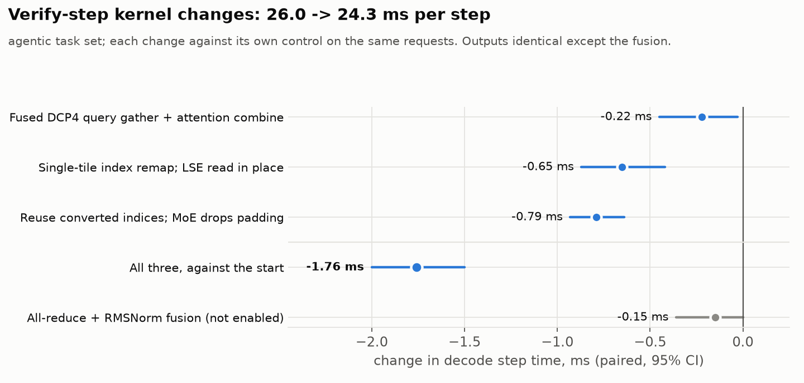
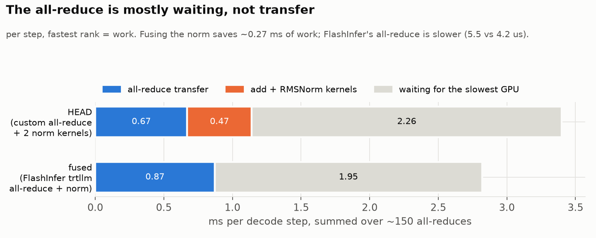
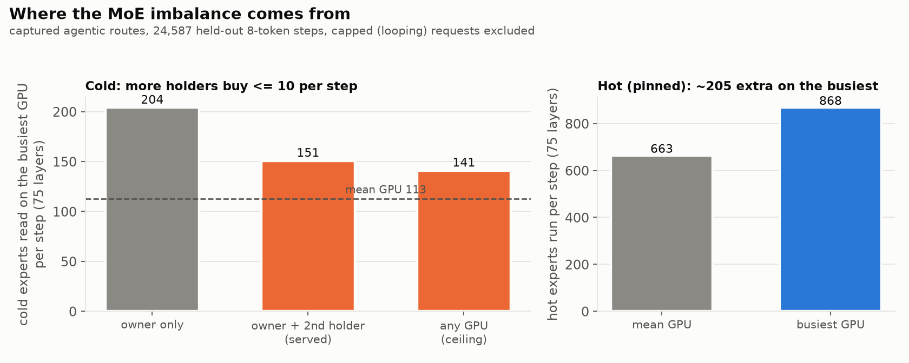
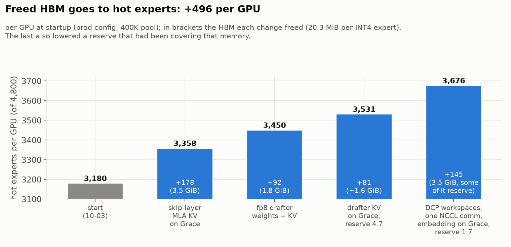
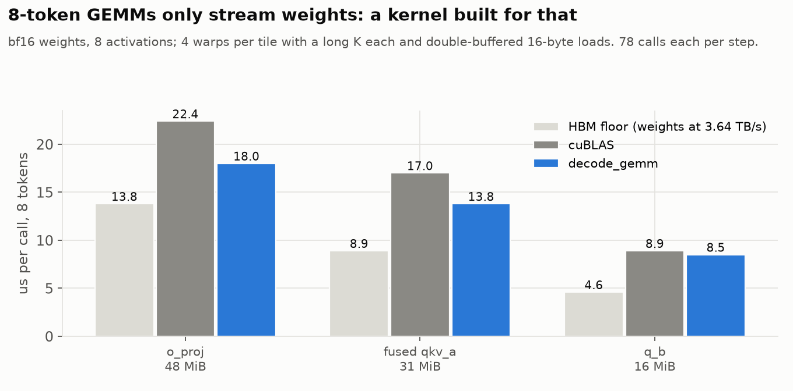
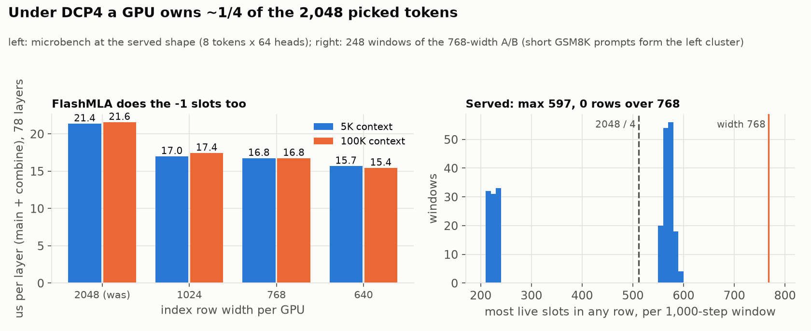
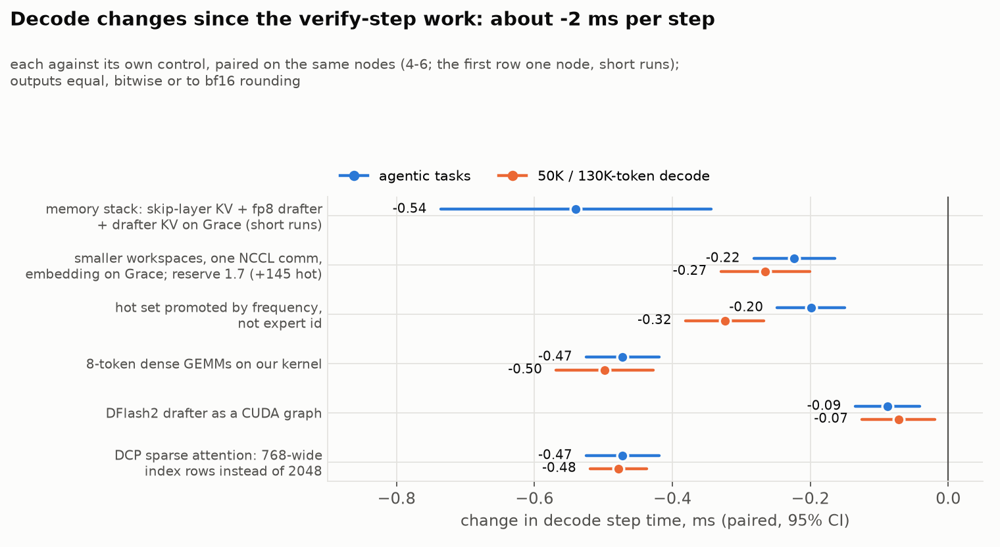
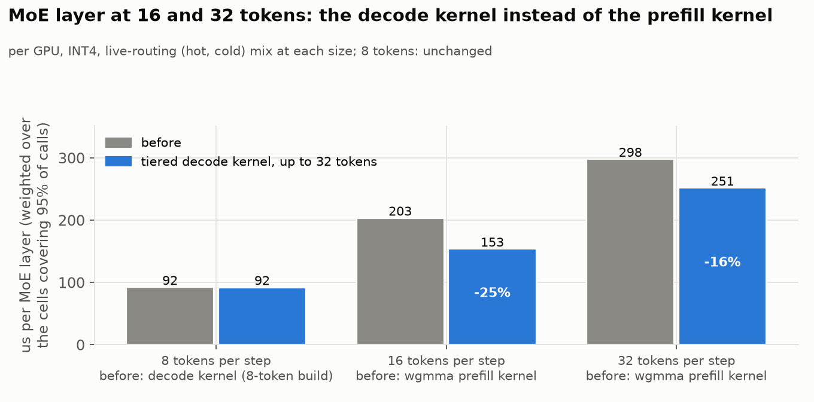
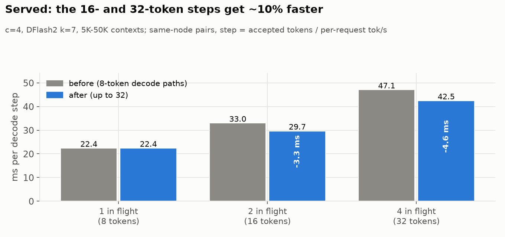
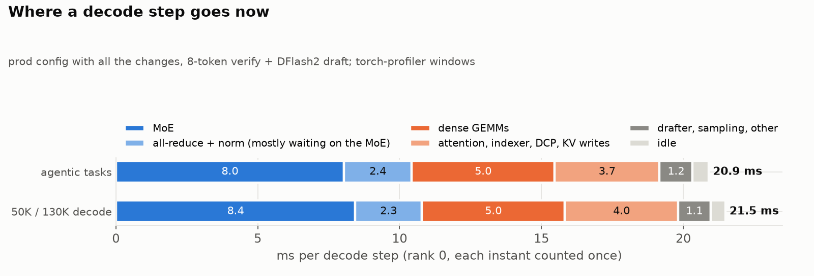

# GLM-5.3 on the tiered MoE path

A running log of serving **GLM-5.3 W4A16** on one 4x GH200 node, at the shape
we actually use: one user at a time, **7 draft tokens** (DFlash2 now, MTP
before; every decode step verifies 8 tokens), **400K context**. The ideas are the ones in the
[main write-up](../README.md); this page is about what was different for GLM and
what it took. It gets updated as work lands.

Prefill has its own page: [GLM-5.3 prefill](prefill/README.md) (TTFT at the
agentic shape 3.43-3.49 -> 2.75-2.83 s).

Both models measured the same way, on the agentic coding tasks MiMo's routing
profile was built from (see [How it's measured](#how-its-measured)):

| one user, same tasks and harness | decode step* | accepted/step | decode tok/s |
| --- | ---: | ---: | ---: |
| **GLM-5.3** W4A16, MTP7, DCP4, 400K | **28.1 ms** | 3.49 | **~124** |
| **GLM-5.3** W4A16, DFlash2 (eager draft), DCP4, 400K | 25.9 ms | 3.25 | ~125 |
| **GLM-5.3**, DFlash2, after the verify-step kernel work ([7](#7-kernel-work-on-the-verify-step-dflash2-dcp4-reserve-7)) | **24.4 ms** | 3.46 | **~142** |
| **GLM-5.3**, + fused all-reduce/RMSNorm (now default) | **~24.0 ms**† | | **~144**† |
| **GLM-5.3**, + more hot experts and decode kernel work ([8](#8-more-of-hbm-for-hot-experts), [9](#9-decode-micro-optimizations)) | **~21.0 ms**‡ | 3.54 | **~168**‡ |
| MiMo-V2.6 MXFP4, DFlash k=7, 250K | 16.9 ms | 3.53 | ~201 |

\*Fitted at matched acceptance and 8K context; tok/s is step-weighted over the
whole task set. †The row above minus the fusion's same-node saving
(0.44 ms), at the same acceptance. ‡Mean step over the same task set in the
section 9 A/B (21.47 ms at full index width, minus that change's 0.47 ms), at
the pooled 3.54 accepted tokens per step; not the 8K fit of the rows above. The
paired deltas of sections 8-9 sum to about -2 ms. All accept 3.3-3.6 tokens per
step on these tasks.

## How it's measured

Everything is measured on the same data for both models: the 16 agentic coding
tasks (22 turns, a few hundred requests) that MiMo's routing profile was
captured from. They're replayed through that capture's agent loop, with the
same system prompt, tools and chat endpoint, at the models' own sampling
(temperature 1.0, top_p 0.95). Each request's decode time, verify steps and
accepted tokens come from the server's own counters, and step time is fitted
against accepted tokens and context so the two models compare at the same
point. Requests that loop to the output cap are dropped (MiMo 3 of 46, GLM
none).

**Earlier GLM numbers used a different bench, and its absolute numbers were
wrong.** It was greedy decoding on raw completion prompts, and that text loops:
MTP accepted 6.5-7 of 8 drafts per step, against 3.5 on the agentic tasks and
the 2-3 you see serving Claude Code. It also routed differently: the hot set
served 74% of its expert reads against 90% on real traffic. So its step times
(46.6 -> 36.2 ms, "~166 tok/s") don't describe real serving, and neither did
the "step time rises ~1.8 ms per accepted token" effect it showed. On the
agentic tasks that effect is gone (+0.1 ms per token). Each change was still
A/B'd against its own control on that bench, so the deltas below are real but
were measured on looping text; they're marked *(greedy bench)*.

## How GLM differs from MiMo

- **It's natively bf16, so W4 is already an aggressive cut.** MiMo ships MXFP4;
  GLM-5.3 had to be quantized to int4 to fit at all. So nothing gets quantized
  further here: attention, the shared expert and the dense layers stay bf16.
- **Bigger experts, fewer of them in HBM.** 256 experts x 75 MoE layers; each
  int4 expert with its group-32 bf16 scales is 20.3 MiB. That's 4,800 experts
  per GPU, and at the start only ~48% of them fit in HBM (MiMo: ~57%).
- **Different attention.** MLA plus DeepSeek-style sparse attention: an indexer
  picks 2,048 past tokens per query and only those are read. At 400K context the
  KV cache is ~20 GiB per GPU when every GPU holds a full copy.
- **A shared expert** runs alongside the routed ones, in bf16.
- **A sequential drafter.** MTP7 runs its draft layer seven times, one token
  after another; MiMo's DFlash drafts all seven in one pass.

## Why MiMo is faster, on the same tasks

Profiled on the agentic tasks, four windows per model, with GLM running the
same kind of drafter as MiMo (DFlash2, section 6). GLM's experts are larger,
but it touches about as many of them per step (~650 hot and ~130 cold per GPU
on both), and at equal expert counts its INT4 kernel is within 2-7% of MiMo's
MXFP4 one. So the MoE is not where the gap is: 9.5 against 8.9 ms, and with
MTP7 and a bigger hot set GLM's MoE is actually cheaper (8.2 ms). GLM's extra
~9 ms is everything around it:
- **dense GEMMs, +2.2 ms**: GLM's MLA and indexer projections and its shared
  expert, all bf16;
- **small unfused kernels, +1.5 ms**: hundreds per step from the MLA, sparse
  attention and DCP code paths (zero-fills, concats, casts, DCP's attention
  merge), where MiMo has three fused norms;
- **DCP's collectives, +1.5 ms**, and **attention plus the indexer, +1.4 ms**;
- **the TP all-reduce, +1.1 ms**, nearly all of it GPUs waiting on the slowest
  one, which follows the MoE's imbalance (with MTP7 it's 2.3 ms, level with
  MiMo);
- **the drafter, +0.2 ms**: with DFlash2 the drafter gap is gone. MTP7's seven
  sequential passes cost 3.6 ms, against DFlash2's 1.1.

Roughly half of that is structural (the extra attention machinery); the other
half is kernels running below what the hardware allows, which is where the
work goes next.

## 1. Routing, and how much the HBM budget buys

Routing statistics are from the agentic tasks, ranked on some requests and
measured on held-out ones. GLM's routing is skewed but flatter than you might
hope: the busiest expert in a layer gets ~6x a uniform share, and the top half
of experts takes ~81% of routes.

Keeping each layer's most-used experts in HBM serves 72% of routes at the
starting budget and 86% once DCP4 grows it (section 4):

What a decode step actually pays for is **distinct cold experts**, since each
one read from Grace costs ~55 µs over NVLink-C2C. Per GPU per 8-token step:

Every ~300 extra hot experts per GPU saves roughly 2 ms per step. Two cheap wins
came straight from this:
- the HBM reserve was 10 GB, sized for an earlier drafter's KV cache; MTP doesn't
  need it, and 7 GB gives **+143 hot experts** per GPU;
- the prefill staging buffer (it copies the next layer's cold experts into HBM
  during prefill) was also sized for the replicas of section 2, which prefill
  never reads. Sizing it for a layer's own cold experts gave back 34 hot
  experts per GPU with 985 replicas, 88 with 2,000.

## 2. Keeping the four GPUs in step: replicas

After each MoE layer the four GPUs sync, so every layer costs as much as its
busiest GPU, and which GPU is busiest changes from layer to layer. On held-out
agentic steps, the busiest GPU reads 93 more cold experts per step than the
average one.

The fix is the same as for MiMo: keep spare copies of busy cold experts in
another GPU's Grace memory, and at each step send an active cold expert to
whichever of its two holders is less busy. The production placement already had
985 copies per GPU, but they had never been switched on for GLM-5.3: an earlier
attempt ran out of memory. That turned out to be PyTorch's pinned-memory
allocator rounding every buffer up to a power of two (fixed during the MiMo
work), not a real shortage.

With up to 2,000 copies per GPU the busiest GPU's excess drops from 93 to 39
cold experts per step. Measured: **-4.1 ms per step** *(greedy bench, 985
copies)*.

### The hot set, rebuilt from the agentic tasks

The first profile was ranked on Claude-Code traffic and listed 2,496 hot
experts per GPU. Under DCP4 (section 4) a GPU holds ~3,210, and the planner
filled the other ~715 **in expert-id order**, with no frequency information at
all. The profile is now built from the same agentic tasks as MiMo's, ranking
all 3,239 slots by frequency (the planner only ever trims the least-used), with
up to 2,000 replicas per GPU. Replayed offline at the runtime budget, it cuts
the busiest GPU's cold reads by ~20%, and by as much on the old profile's own
Claude-Code traffic as on the agentic tasks, so the gain is from ranking the
whole budget rather than from fitting the workload:

Measured: **-0.94 ± 0.12 ms per step** *(greedy bench)*.

## 3. One kernel for both tiers, now for INT4

MiMo's decode MoE runs as one kernel that streams hot experts from HBM and cold
ones from Grace at the same time. GLM's experts have the same shape, so porting
it was just the weight format:
- int4 values decode exactly into f16 with one instruction per pair
  (`0x6400 | code`, then a fused multiply-add), landing on the same scale the
  MXFP4 path uses, so nothing downstream changed;
- the bf16 group scales sit in Marlin's layout, which conveniently puts the two
  scales a thread needs in one 32-bit word.

The kernel is more accurate than Marlin against an fp32 reference (error 3e-3 vs
6-7e-3 of the row max), and at equal expert counts it runs within 2-7% of the
MXFP4 kernel MiMo uses. **On its own it bought nothing end to end**: it does
~2 ms less MoE work per step, but that time just became waiting on the slowest
GPU. Once replicas were on, the kernel's other job paid off: it picks each
replica's GPU by predicted *time* rather than expert count. **-1.4 ms more**
*(greedy bench)*.

## 4. DCP4: sharding the KV cache across the GPUs

At one user, every GPU held a full copy of the 400K KV cache. With decode context
parallelism (DCP4) each GPU keeps a quarter of it. Two things improve:
- **~16 GiB per GPU freed**, which becomes ~780 more hot experts (2,427 -> ~3,210);
- **attention stops wasting work.** The FP8 sparse attention kernel only runs with
  64 or 128 query heads, so each GPU's 16 heads were padded to 64. Under DCP the
  queries are gathered across GPUs, so the kernel sees 64 real heads.

The catch is three small collectives per layer (gather queries, gather softmax
sums, scatter outputs), each ~7-12 µs through NCCL. They cost ~2.3 ms per step and
ate most of the gain: **-1.1 ms net** at first *(greedy bench)*.

vLLM already has a fast path for small all-reduces: each GPU reads the others'
buffers directly over NVLink, between two cheap barriers, in one kernel. The same
trick works for a gather (copy instead of add) and a reduce-scatter (add only your
own slice), reusing that path's shared buffers and CUDA-graph bookkeeping. A query
gather dropped from 13.8 to 6.7 µs, and end to end the step got **3.1 ms faster**
*(greedy bench)*, more than the collectives' own kernel time: NCCL was also
leaving gaps between kernels that are now gone. (vLLM's all-to-all variant of the
combine measured within noise; NCCL's symmetric-memory kernels broke CUDA graph
capture here.)

**On the agentic tasks, DCP4 still wins, even against a shorter context.** With
DCP off at MiMo's 250K context, a step takes 28.8 ms against DCP4's 27.7-28.1
at 400K (same tasks and point; prefix caching doesn't change decode, as the
next section shows). The full MLA cache on every GPU
leaves room for only ~2,815 hot experts against ~3,208, and the head padding
comes back.

### Prefix caching under DCP4

Claude Code resends the whole conversation every turn, so prefix caching is not
optional. Under DCP4 it crashed on the first cache hit. Sparse attention falls
back to dense attention when the whole prompt fits in the indexer's 2,048
tokens, and the dense path reads the cached context back through gathers that
don't understand GLM's KV format (fp8_ds_mla: 512 fp8 values, four fp32 scales
and 64 bf16 rope values per 656-byte entry). With DCP that failed a dtype check.
**Without DCP it silently read garbage** (relative error ~321, with NaNs), so
every prefix hit on a short prompt attended over corrupted context. The fix
copies the raw entries and decodes them properly. On the agentic tasks with
prefix caching on: no errors, a 78% cache hit rate, total prefill time 70 s
instead of 298 s, and decode unchanged.

## 5. The drafter was running uncaptured

MTP drafts in 7 passes: one over 8 tokens, then six over a single token each.
vLLM only builds a CUDA graph for the single-token passes if the capture sizes
include a size that fits one user, and ours listed only 8. So six of the seven
draft passes ran as ~430 separate kernel launches every step, silently. Capturing
size 1 as well fixed it: **-0.65 ms** *(greedy bench)*. (The profiler had
suggested ~5 ms; the CPU was mostly launching ahead of the GPU anyway.)

## 6. DFlash2 instead of MTP7

DFlash2 drafts all 7 tokens in one pass of a small 6-layer model instead of
MTP's seven sequential passes. It had been stuck on DCP1, because under DCP4
it lost ~38% of its acceptance, and the cause had never been found.

**The bug was cache addressing.** GLM's MLA pages and the drafter's pages
can't be unified, so vLLM falls back to one cache group holding all 84 layers,
and under DCP4 that group is sharded: each block covers 256 positions, of which
an MLA layer keeps its GPU's 64. The drafter's KV is replicated, not sharded,
but it still had 64-token pages and indexed the block table as if each entry
covered 64 positions. So under DCP4 it only ever held its own KV for the first
64 positions of a sequence. The fix gives replicated layers in a sharded group
full 256-token pages, addressed in those units, and budgets them in the tiered
planner. Acceptance under DCP4 now matches DCP1 request for request.

On the agentic tasks, eager drafter, DCP4:

| | decode step | accepted/step | decode tok/s |
| --- | ---: | ---: | ---: |
| MTP7 | 28.2 ms | 3.49 | 124 |
| DFlash2 | 26.9 ms | 3.35 | 125 |
| DFlash2, DCP1 | 35.1 ms | 3.37 | 96 |

Two things stand out:
- **DFlash2 accepts no more than MTP7 on real agentic text** (3.35 vs 3.49).
  On GSM8K it accepts ~5.7; its edge there doesn't carry over to this workload.
- **Its drafter is much cheaper** (1.1 ms against MTP7's 3.6), but the verify
  pass got 1.7 ms slower. Its KV and a 10 GB HBM reserve leave 2,951 hot
  experts per GPU against MTP7's 3,208, which shows up as more MoE time and
  more waiting in the all-reduce (above).

The drafter runs eagerly, not as a CUDA graph: capturing it costs acceptance
(an open bug, since gone: section 9). That is not where the time is, though. The trace puts the whole
draft pass at 188 kernels and 1.1 ms of GPU time, and under Nsight Systems the
GPU is idle only ~0.3 ms per step (section 7), so a CUDA graph could win back
little. The 10 GB reserve dates from before the planner budgeted the drafter's
KV; with that fixed, DFlash2 serves at MTP7's 7 GB reserve (free HBM stays flat
at ~6.5 GiB over the task set) and its step drops to **25.9 ms** (fitted), now
the serving default and the starting point for section 7.

## 7. Kernel work on the verify step (DFlash2, DCP4, reserve 7)

**The host is not the bottleneck.** Under the torch profiler some steps seemed to
stall 1-11 ms waiting on one GPU's host, but that was the profiler's own
per-kernel overhead. Under Nsight Systems with graph-level tracing the GPU is
busy ~99% of the step (0.3 ms idle), the four GPUs enter each step within
~18 us of each other, and launching the verify graph takes 0.3 ms. So all the
remaining time is kernels.

Five changes, each with identical output (bitwise, or checked equal in the
served model), each A/B'd on the agentic tasks against its own control:

| change | step time, paired (95% CI) |
| --- | ---: |
| DCP4: query concat + gather, and the attention combine (LSE gather, correction, reduce-scatter), each fused into one kernel on the custom all-reduce buffers | -0.22 ms (-0.45 to -0.03) |
| sparse-attention index conversion: one program per row (upstream #50365), no zero/-1 fills; the combine reads the LSE in place, dropping a mask that could not change the result | -0.65 ms (-0.87 to -0.42) |
| the 57 of 78 layers that reuse another layer's top-k reuse its converted indices too; the MoE route kernel drops padded tokens itself | -0.79 ms (-0.93 to -0.64) |
| **all of the above, against the start** | **-1.76 ms (-2.00 to -1.50)** |

Step time goes **26.0 -> 24.3 ms** on the task set and **25.6 -> 23.7 ms**
unprofiled (nsys); kernels in the verify graph drop from 3,407 to 2,576 per
step. At the same acceptance that is **~133 -> ~142 decode tok/s**.

**Fusing the all-reduce with the next RMSNorm** crashed before because these
GPUs are linked directly, without NVSwitch, so NVLink multicast is unavailable,
yet vLLM's auto choice was FlashInfer's multicast backend. With the right
backend it runs (and needed a compile fix for DFlash2's selector). Measured
against the unfused build **on the same node** (four nodes, each running both),
it saves **0.44 ms per step (95% CI 0.28 to 0.59)** with acceptance unchanged,
and it is now the default. A first estimate that compared arms on different
nodes said only -0.15 ms: at this size the node-to-node spread swamps the
effect, so every comparison since is paired within a node. FlashInfer's fused
all-reduce is still slower than vLLM's own (5.5 vs 4.2 us per call), which
costs part of what dropping the norm kernels saves. Unlike the changes above,
the fusion is not bitwise: it sums in a different order.

**Running the sparse-attention indexer on a second CUDA stream** (the idea of
upstream vllm#47355, with the DCP gather kept on the main stream so collectives
keep one order) did not pay: -0.13 ms (-0.34 to +0.07), same-node pairs. The
part that can move off the critical path is small, and the indexer's
cross-GPU merge stays serial. Not adopted.

**What the all-reduce really costs is waiting**: ~2 ms per step of GPUs idle
at the ~150 all-reduces until the slowest one arrives, against ~0.7 ms of
actual transfer. That is MoE imbalance, and more replicas cannot fix it: every
cold expert already has a second holder, and even letting any cold expert run
on any GPU would save at most ~10 cold reads per step on the busiest GPU. The
imbalance is in the pinned hot experts (~868 on the busiest GPU per step
against ~663 on average), which is what an ownership rebalance would target.

## 8. More of HBM for hot experts

A GiB of HBM holds ~50 INT4 experts, and every hot expert is one less read over
C2C. Four changes, none touching the math, took the hot set from **3,180 to
3,676 experts per GPU**:

- **Skip-layer KV on Grace.** 57 of the 78 layers reuse the top-k of the
  indexer layer before them. Their MLA KV (3.5 GiB per GPU at 400K) now lives
  on Grace. Right after that indexer layer's attention, a side stream copies
  the rows its top-k picked (~600 per GPU, ~23 MB per step) into an HBM
  staging buffer, so those layers still read HBM; the copy is done ~100 µs
  before it's needed.
- **fp8 drafter weights and KV** (acceptance unchanged), and **the drafter's KV
  on Grace**: its 2,048-token sliding window reads over C2C for +19 µs per step.
- **Memory nobody needed**: DCP's prefill workspaces sized to what they hold
  (-2.15 GiB), one NCCL communicator shared by the TP, DCP and EP groups that
  span the same GPUs (-0.94 GiB), and the input embedding on Grace (a step
  gathers 8 rows; -0.44 GiB). That let the planned HBM reserve drop from 4.7
  to 1.7 GB with the startup free-memory check still passing.
- **Promote the right experts.** The profile ranks 3,239 hot experts per GPU;
  the planner filled the slots past that in expert-id order. The profile now
  lists the rest by route frequency on live Claude Code traffic. Same count,
  better experts.

| change | agentic tasks | 50K / 130K decode |
| --- | ---: | ---: |
| skip-layer KV + fp8 drafter + drafter KV on Grace (one node, short runs) | -0.54 ms (-0.74 to -0.34) | |
| reclaimed workspaces / communicator / embedding, reserve 1.7 | -0.22 ms (-0.28 to -0.16) | -0.27 ms (-0.33 to -0.20) |
| frequency-ordered promotion | -0.20 ms (-0.25 to -0.15) | -0.32 ms (-0.38 to -0.27) |

Paired step-time deltas, 95% CI; GSM8K unchanged in each.

## 9. Decode micro-optimizations

**The 8-token GEMMs on our own kernel.** At 8 tokens a bf16 GEMM only streams
its weights, and cuBLAS got 52-62% of the HBM floor on GLM's attention
projections. `decode_gemm` gives each 16-row tile 4 warps, each over a long K,
with double-buffered 16-byte loads into `mma.m16n8k16` (the 8 tokens as N).
All verify-step linears together: 5.31 -> 4.53 ms in isolation. The shared
expert stays on cuBLAS: on its side stream our kernel fills every SM and
delays the MoE. Two things that didn't work: prefetching o_proj's weights into
L2 (no idle bandwidth window long enough) and a TMA ring (at these sizes TMA
streams start ~4.6 µs later than plain loads).

**The DFlash2 drafter as a CUDA graph.** Section 6 left it eager because the
captured graph cost 44% of acceptance. On the current stack the replay is
bit-identical to eager: hidden states, candidates, selector scores and tokens
at every probed step, so one of the DCP-port fixes most likely removed the
cause. Captured now. It's worth only 0.09 ms because the eager drafter was
already GPU-bound; profiles had promised more, but the profiler's per-launch
cost inflates eager regions.

**Narrower sparse-attention index rows under DCP4.** Each query attends to the
2,048 tokens the indexer picked, and under DCP4 a GPU owns about a quarter of
them. Each GPU still got a 2,048-wide index row: its own ~512 compacted to the
front, -1 after. FlashMLA's sm90 kernel gives a -1 no shortcut (it loads a
row, dequantizes it, runs both GEMMs and masks it in the softmax), and its
early stop isn't supported for this KV format. The index conversion now
writes 768-wide rows (`VLLM_DCP_SPARSE_DECODE_WIDTH`, now the default): 21.4 -> 16.8 µs
per layer. A row with more live slots than that would lose keys, so the same
kernel counts them; in serving the most seen was 597, never over 768.

| change | agentic tasks | 50K / 130K decode | GSM8K |
| --- | ---: | ---: | ---: |
| `decode_gemm` for the 8-token dense GEMMs | -0.47 ms (-0.52 to -0.42) | -0.50 ms (-0.57 to -0.43) | 91.4 -> 92.1% |
| drafter as a CUDA graph | -0.09 ms (-0.14 to -0.04) | -0.07 ms (-0.13 to -0.02) | 90.9 -> 91.4% |
| 768-wide index rows | -0.47 ms (-0.52 to -0.42)§ | -0.48 ms (-0.52 to -0.44) | 91.3 -> 91.9% |

§Two short requests excluded, one in each arm, that stalled at 72 and 120
ms/step (cause not found); with them, -0.38 ms (-0.93 to +0.16). The drafter
graph's output is bitwise equal; the two kernel changes sum in a different
order, so they match to bf16 rounding.

Not adopted: a GLM-specific cost table for the replica balancer (-0.05 ms in
replay), and folding the shared expert into the MoE kernel (the MoE is
C2C-bound with SMs to spare, and the shared expert already hides on its side
stream).

## 10. More than one user: 8 -> 32 tokens per step

With c concurrent requests the verify step carries c x (draft + 1) tokens.
Everything built for decode stopped at 8, so c=2 / c=4 / c=8 with a 3-token
drafter (8 / 16 / 32 tokens) fell back to paths made for other jobs:

| gate | at 8 | above 8, the server ran | now |
| --- | --- | --- | --- |
| tiered decode MoE | one kernel, both tiers | the wgmma prefill MoE | up to 32 tokens |
| decode GEMMs | `decode_gemm` | cuBLAS | up to 32, configs per size |
| skip-layer KV staging | staged into HBM | **the 57 skip layers' attention reading KV over C2C** | up to 32 queries |
| `max_num_seqs` | 1-4 allowed | refused | 1-8 |

**MoE.** Replaying live Claude Code routing at 16 / 32 tokens (2 / 4
concurrent requests): at the 95th percentile a GPU runs ~37 hot and ~6 cold
experts per layer, and only 1.2% of experts get more than 8 tokens.
So a list entry keeps at most 8 tokens (the MMA's N; the shared-memory stages
are unchanged) and route-prep gives an expert with more several entries.

**GEMMs.** `decode_gemm` takes 1-4 tiles of 8 tokens, each weight fragment
feeding all of them: 2-17% under cuBLAS at 9-16 tokens, still 5-11% on o_proj
and the dense MLP at 32; q_b past 16 and fused qkv_a at 32 stay on cuBLAS,
which is level there. **Staging** buffers are sized to the config (queries x
the 768-wide index rows), which also frees 20 MB at c=1.

Served at c=4 with a 7-token drafter (3 nodes, before/after on each): the
16-token step -3.3 ms (-10%), the 32-token step -4.3 to -4.8 ms (-10%), the
8-token step unchanged; total throughput +8-11%.

**How far concurrency goes** (decode tok/s per request / total, 5K and 50K
contexts averaged; 4 tokens verified per request):

| config | hot / GPU | 1 in flight | 2 | 4 | 8 |
| --- | ---: | ---: | ---: | ---: | ---: |
| c=2, MTP3 | 3,550 | 165 / 153 | 127 / 228 | | |
| c=2, DFlash2 k=3 | 3,591 | 158 / 148 | 125 / 223 | | |
| c=4, MTP3 | 3,382 | 154 / 143 | 125 / 221 | 96 / 331 | |
| c=4, DFlash2 k=3 | 3,429 | 148 / 138 | 121 / 213 | 95 / 331 | |
| c=8 at 200K, MTP3 | 3,381 | 155 / 144 | 123 / 218 | 94 / 322 | **65 / 439** |
| c=8 at 200K, DFlash2 k=3 | 3,427 | 147 / 138 | 118 / 214 | 93 / 323 | **65 / 432** |
| c=8 at 400K, 500 replicas, MTP3 | 3,044 | 132 / 123 | 101 / 182 | 78 / 274 | 55 / 369 |
| c=8 at 400K, 500 replicas, DFlash2 k=3 | 3,108 | 131 / 123 | 101 / 182 | 78 / 281 | 54 / 367 |
| c=8 at 400K, no replicas, DFlash2 k=3 | 3,108 | 124 / 116 | 97 / 172 | 72 / 253 | 51 / 340 |

- **c=4 doubles throughput, c=8 nearly triples it** (~330 and ~435 tok/s
  against ~165 for one user), at ~95 and ~65 tok/s per request.
- **MTP3 and DFlash2 k=3 are level** at every size: MTP3 accepts a little
  more, DFlash2's step is a little shorter. MTP3 needs a 3.6 GB HBM reserve
  (the planner under-counts its layer) where DFlash2 runs at 1.7.
- **c=8 at full 400K does not fit Grace** with prod's 1,350-1,960 replicas
  per GPU: 8 x 400K of skip-layer and drafter KV plus the extra cold experts
  exceed it. Fewer hot experts would not help (each one moved out of HBM
  lands on Grace). With 500 replicas it fits and costs 15% against c=8 at
  200K (367 vs 432); with none, 21%.

## What's left

Of a ~21 ms step:
- **the MoE, ~8 ms, plus most of the 2.4 ms all-reduce**, which is GPUs waiting
  for the slowest one's MoE: hot-expert imbalance;
- **dense GEMMs, 5 ms**: `decode_gemm` is near its floor; ~1.8 ms is still on
  cuBLAS/CUTLASS (small shapes, the indexer's fp8 projections, the shared
  expert, the drafter);
- **attention, the indexer and DCP's collectives, 3.7-4 ms**: FlashMLA still
  splits each layer 16 ways and merges the parts (~0.2 ms exposed); the
  indexer's work grows with context; the collectives are near transfer cost;
- **the drafter and sampling, 1.2 ms**, and ~0.5 ms idle.

All of it keeps the math identical: no further quantization, no change to the
drafter or to which experts run.

## Accuracy

GSM8K, four full runs of each setup pooled over the 1,000 questions they share:
**91.0% now against 91.4% before**, a difference of -0.3 points (95% interval
-0.9 to +0.3). Greedy decoding isn't reproducible here: the old setup changes
~43 answers against itself from run to run, so a single paired run can't
resolve differences below ~1.3 points. No detectable regression.

## Where the data is

Raw data, scripts and every run are in the worklog:
- `experiments/2026-09-28-agentic-decode-bench`: the agentic-task harness, both
  models' runs and profiles, DCP off, and the prefix-caching fix;
- `experiments/2026-09-28-glm53-route-cap`: the agentic-task routing capture and
  the rebuilt profile;
- `experiments/2026-09-27-glm53-mtp7-profile`: the greedy-bench A/Bs, GSM8K, and
  the figures (`plot_glm.py`);
- `experiments/2026-09-29-glm-verify-kernels`: the kernel work in section 7,
  its traces, tests and A/Bs;
- `experiments/2026-10-06-skip-layer-kv-grace`, `2026-10-07-mem-reclaim`,
  `2026-10-08-moe-cost-table`: section 8;
- `experiments/2026-10-07-skinny-gemm-v2`, `2026-10-08-dflash2-cudagraph`,
  `2026-10-08-flashmla-split`: section 9;
- `experiments/2026-10-08-decode-dive-3`: the step breakdown and these
  sections' figures (`plot_micro.py`).
- `experiments/2026-10-08-m32`: section 10: routing replay, kernel grids,
  the served A/B, the concurrency sweep and its figures (`plot_m32.py`).
