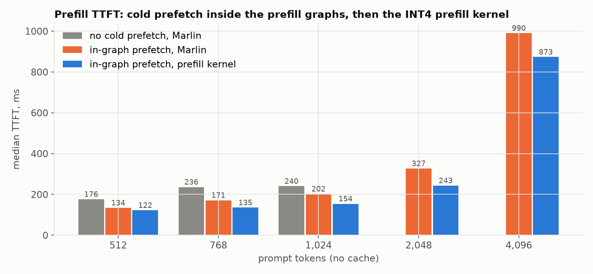
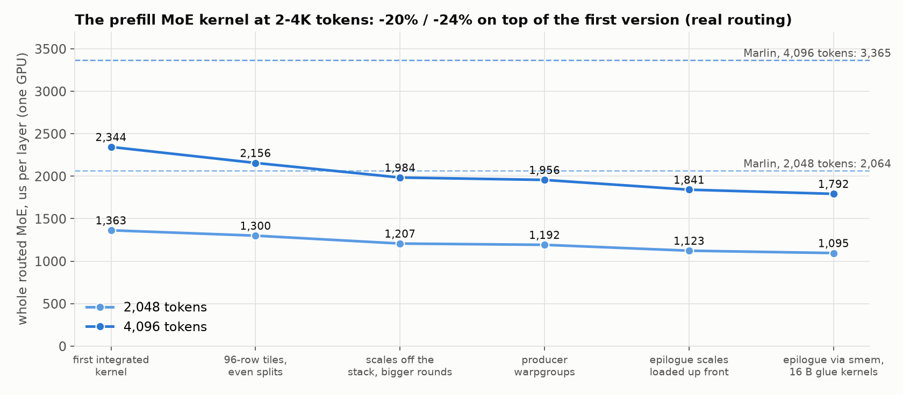
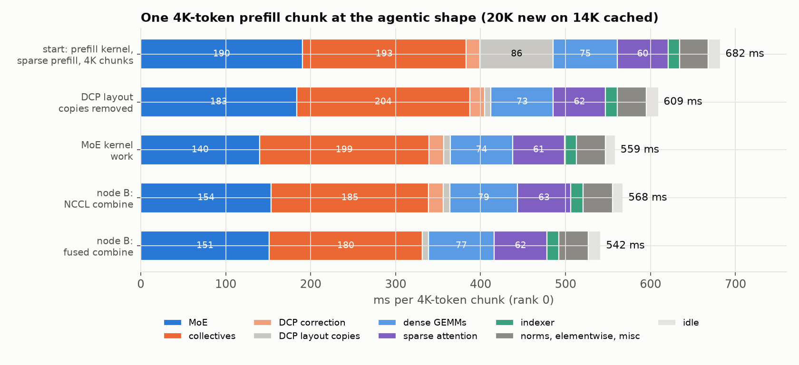

# GLM-5.3 prefill

How prefill got faster for **GLM-5.3 W4A16** on one 4x GH200 node, at the
serving config of the [GLM page](../README.md) (DCP4, DFlash2, tiered MoE,
KV on the GPUs). The measuring stick is the shape we actually see from a
coding agent: **~20K new tokens on a ~14K cached prefix**, prefilled in
4K-token chunks.

| at 20K new on 14K cached | TTFT | 4K chunk |
| --- | ---: | ---: |
| start: prefill kernel, sparse prefill, 4K chunks | 3.43-3.49 s | 682 ms |
| DCP layout copies removed | 3.09-3.14 s | 609 ms |
| MoE kernel work | 2.84-2.85 s | 559 ms |
| fused DCP combine (same-node A/B on a slower node: 2.88-2.95 -> 2.75-2.83 s) | -4.4% | -26 ms |

Same math throughout (no quantization or algorithm change); outputs are
checked against references, and GSM8K (400, 5-shot greedy) stayed at 90-91%.

## 1. Cold experts in the prefill graphs

Prefill runs in piecewise CUDA graphs up to 1,024 tokens. The next layer's
cold experts are copied from Grace into an HBM slot while the current layer
runs, and the copy now lives inside the captured graphs: **-33 to -64 ms**
TTFT at 512-1,024 tokens. From ~768 tokens the copy hides entirely under the
MoE.

## 2. An INT4 prefill MoE kernel

Marlin (vLLM's W4A16 MoE) is built for small batches: at 2K / 4K tokens its
whole MoE takes 2.1 / 3.4 ms per layer. The new kernel reads Marlin's
tensors in place:

- Hopper wgmma with the INT4 weights decoded in registers to **exact f16**
  ((code - 8) x scale fits in f16; activations take a power-of-two row scale),
  fp32 accumulation; error vs fp32 is 1.1e-3 of output RMS, Marlin's 3.9e-3.
- Tokens are grouped per expert and run in five tile widths (16 to 128 rows),
  chained with programmatic dependent launch; routing, gather, SiLU and
  combine are their own small kernels. CUDA-graph capturable, deterministic.

Same node, 20 prompts each: **-9% to -26% TTFT** at 512-4,096 tokens.

Tuning it for 2-4K-token chunks then took the whole MoE from 2,344 to
**1,792 us per layer at 4K** (2,048 tokens: 1,363 -> 1,095), base-clock ncu
guiding each step:

- a 96-row tile and even splits of large experts (padding 1.31x -> 1.18x);
- the per-round scale words were spilling to local memory (an `STL` per round);
  loading only each warp's words fixed it, and with bigger wgmma rounds and a
  producer warpgroup the 128-row tile's tensor pipe went 68% -> 87% busy;
- the epilogue loaded each row scale between bf16 stores the compiler could
  not reorder (~14% of w2's stall samples); now loaded up front, then the
  output is staged in shared memory for 16-byte stores;
- 16-byte accesses in the gather / SiLU / combine kernels (bit-identical).

Tried and dropped: keeping a wgmma round in flight (ptxas then serializes every
wgmma), smaller CTAs for the narrow tiles (they are bound by INT4 decode ALU
work, not SM count).

## 3. Long-context attention

FlashMLA sends every token to its fp8 sparse **decode** kernel when a GPU has
fewer than 32 heads. Under DCP each GPU keeps ~1/4 of the 2,048 top-k slots,
but that kernel costs the same with 3/4 of them masked. Single-request
prefills now upconvert the GPU's KV shard to bf16 and run the sparse
**prefill** kernel with a per-query top-k length: **3.5-4.4x faster attention**,
TTFT for 2K new tokens on 98K cached **637-683 -> 536-579 ms**.

## 4. Chunk size and memory

4K-token chunks instead of 8K, with the planner sizing the prefill kernel's
workspace (0.75 GB, instead of four 8K-token Marlin arenas, 3.2 GB) and a
startup check against the measured activation peak (found with CUDA memory
snapshots): **3,244 hot experts per GPU instead of 3,033**, and a 42-turn run
to 388K context with no OOM.

## 5. DCP's data movement

With the KV sharded, every layer all-gathers the queries (all 64 heads) and
reduce-scatters the outputs, with a log-sum-exp correction between.

- **Layout copies removed**: queries are produced head-major and the
  correction writes head-major, so NCCL splits the leading dim with no
  transpose copies: 86 -> 8 ms per 4K chunk.
- **Fused combine**: the LSE gather, the correction pass and the
  reduce-scatter (~940 us per layer) became one kernel. Attention writes into
  a 257 MiB buffer registered for peer access; each GPU pulls its heads' rows
  from all four over NVLink, weights and sums them: **612 us**. Reading a
  token's heads contiguously matters: in token order the same kernel took
  1.3 ms. Sums are fp32 in rank order instead of NCCL's bf16 ring, so greedy
  text can differ from the old path; GSM8K 90.75% vs 90.50%.

## What's left (per 4K chunk, ~540 ms)

- **Collectives, ~180 ms**: the query all-gather (~64 ms) could go by
  computing q for all heads locally from the replicated q latent (+3.9 GB HBM
  per GPU, fewer hot experts); the post-MoE all-reduce waits ~19 ms for the
  GPU with the most routed tokens (routing-dependent, not fixable by
  placement); the indexer's candidate gather ~17 ms.
- **MoE, ~150 ms**: w2's wide tiles keep the tensor cores 62-67% busy (16
  pipeline stages per CTA; a persistent kernel would hide their fill); the
  narrow tiles are bound by the INT4 decode.
- dense GEMMs 77 ms and sparse attention 62 ms are near their kernels' limits.

## Where the data is

In the worklog, `experiments/2026-10-02-ingraph-prefetch`
([README](https://github.com/alint77/jupiter-glm52-vllm-worklog/tree/main/experiments/2026-10-02-ingraph-prefetch)):
the A/Bs, traces and breakdowns (`prof_window.py`, `breakdown.py`), kernel
benchmarks (`bench_iter.py`, `bench_combine.py`, `p2p_probe.py`), ncu scripts,
and these figures (`plot_prefill.py`); the earlier prefetch work is in
`experiments/2026-09-30-glm-prefill-prefetch`.
