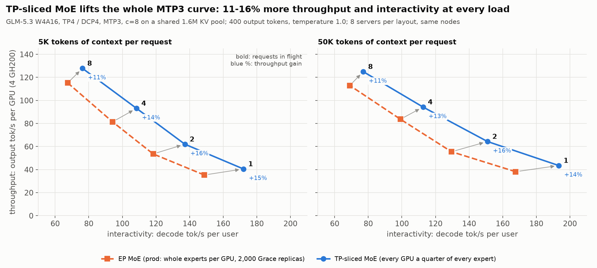
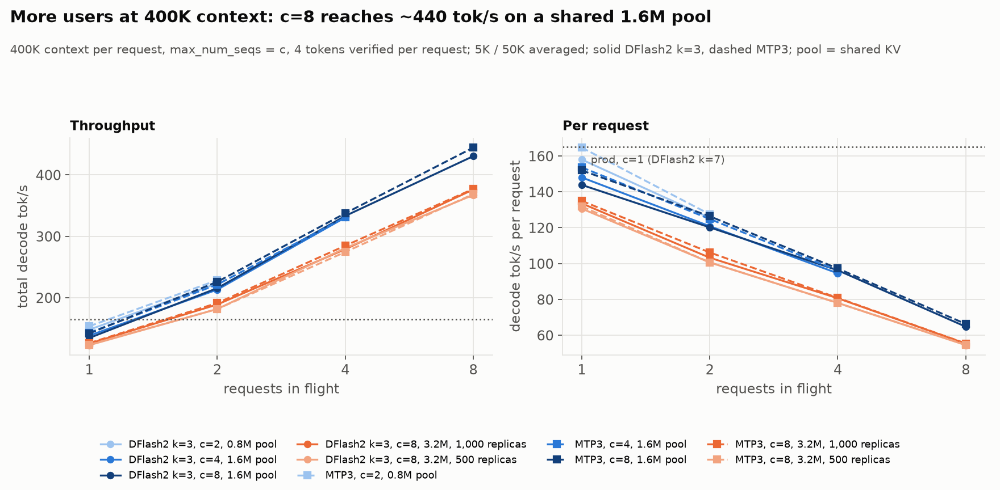
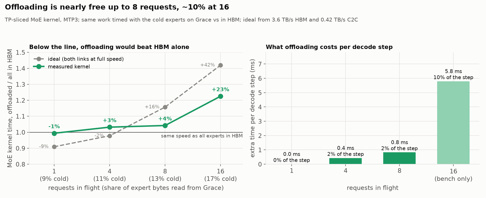
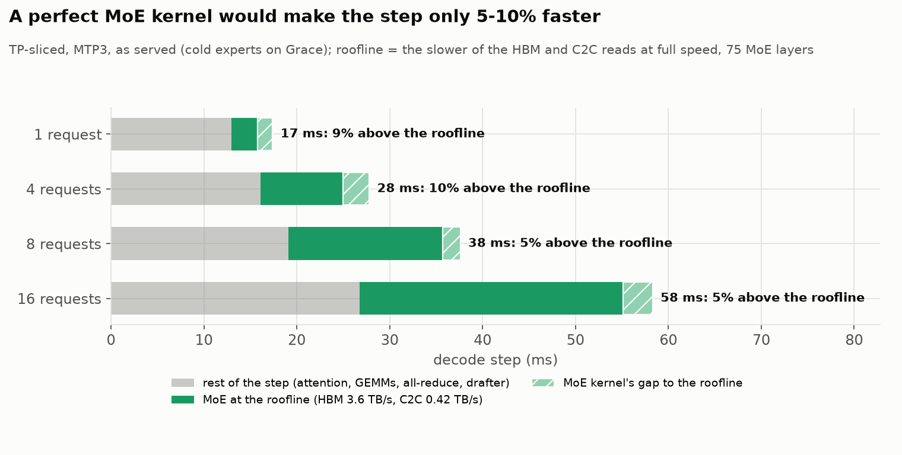

# GLM-5.3: every GPU gets a quarter of every expert (TP-sliced MoE)

Everything about the TP-sliced MoE layout for **GLM-5.3 W4A16** on one 4x
GH200 node: the idea, the kernel, how it's served, and how it compares with
the expert-parallel (EP) layout described on the [GLM page](../README.md).

| | EP (before) | TP-sliced |
| --- | ---: | ---: |
| one user, DFlash2 k=7 (prod config), decode step | ~21.0 ms | **~18.6 ms** |
| one user, MTP3, decode step | 19.5 ms | **17.2 ms** |
| 8 requests, MTP3, tok/s per GPU (5K context) | 115 | **128** |
| most requests per server | 8 | **16 (~685 tok/s)** |
| extra copies of experts on Grace | ~2,000 | **none** |

Same math, same acceptance, same GSM8K.

## The idea

With EP each GPU owns whole experts. Routing is uneven, so every layer waits
for whichever GPU drew the busiest experts, and we kept ~2,000 extra copies of
popular experts on Grace plus a balancer just to even that out.

TP-sliced cuts every expert into four along its intermediate dimension. GPU
*r* holds rows 512r to 512r + 512 of each expert's gate and up projections and
the matching columns of its down projection, for hot experts (in HBM) and cold
ones (in that GPU's own Grace memory) alike. Every GPU computes its quarter of
every expert the step touches, for all tokens, and the all-reduce that already
follows each MoE layer adds the four partial results.

- **All four GPUs do the same work every step**, so nobody waits for a busy
  GPU, and the copies, the balancer and its cost table go away.
- **A cold expert is read over all four C2C links at once**, a quarter each,
  instead of one GPU pulling the whole expert over its own link.
- **The price:** a quarter-expert is a smaller piece of work, so the
  per-expert overhead counts more. Hot experts cost a little more per byte
  than in EP; cold ones cost far less.

## The kernel

One persistent kernel per MoE layer, one block per SM (132), does the whole
layer: the routed experts from both tiers, the shared expert, and the final
`shared + scale x routed` output.

- **Inside each block**, a producer warp streams weights into a 4-stage
  shared-memory ring (45 KB per stage) with TMA copies, from HBM or straight
  from Grace. Eight consumer warps unpack the int4 weights (Marlin-style) and
  run the tensor-core MMAs. A scheduler warp hands out work, and a finisher
  warp applies the activation once all of an expert's gate/up pieces are in,
  so its down projection can start.
- **Work comes from per-tier queues** in four phases: shared expert gate/up,
  routed gate/up, shared down, routed down. 16 blocks prefer cold work and
  the other 116 hot work; a block whose queue runs dry takes the other
  tier's.
- **Up to 64 tokens per call** (16 requests x 4 tokens with MTP3). A list
  entry holds at most 8 tokens (the MMA's width); an expert with more gets
  several entries.

Replaying 2,000 held-out agentic steps through both kernels at the same hot
set, the MoE costs **20% less at 8 tokens and 16% less at 32** than EP's
slowest GPU, which is what sets EP's step. Most of the gain is cold experts:
~4 us per cold expert in a layer against ~26 us under EP.

**Correctness.**
- Checked against fp32 on real checkpoint experts, and in adversarial runs:
  - token counts from 1 to 64;
  - empty tiers, permuted and missing experts, masked tokens;
  - CUDA-graph replays with new inputs, and the epoch counter wrapping.
- The kernel and its tests were reviewed by a second model (Astra) at each
  major step.
- Extending to 64 tokens exposed a rare race. In about 1 call in a few
  thousand, above 40 tokens, the output was garbage. A stage of the ring
  could be refilled by the async copy engine while some warps were still
  reading it, because the barrier between them doesn't order those two kinds
  of memory access. One fence instruction on the producer side fixes it (0
  bad calls in 80,000) at no measurable cost.

## Serving it

`--tiered-moe-layout tp_sliced` (`TIERED_MOE_LAYOUT=tp_sliced` in the serve
scripts) with expert parallelism off and no replicas:

- **Decode** steps run the sliced kernel. **Prefill** runs the wgmma prefill
  kernel at 512 wide, with the cold slices staged into HBM before each chunk.
- **The MTP drafter's MoE layer** loads untiered, as a plain TP MoE.
- **Loading** takes longer (~5.5 min of weights, ~9 min to ready) because every
  GPU reads every expert.
- **The hot set** is one list for all four GPUs: ~13,500-14,700 quarter-experts
  per GPU depending on the HBM reserve, the same residency as EP's ~3,400-3,700
  whole experts.

| config | drafter | max requests | KV pool | HBM reserve | hot slices / GPU |
| --- | --- | ---: | ---: | ---: | ---: |
| prod (Claude Code) | DFlash2 k=7 | 1 | 400K | 1.7 GiB | 14,748 |
| c=8 | MTP3 | 8 | 1.6M (`VLLM_TIERED_MOE_KV_POOL_SEQS=4`) | 3.6 GiB | 13,614 |
| c=16 | MTP3 | 16 | 1.6M | 4.0 GiB | 13,528 |

c=16 also captures CUDA graphs every 4 tokens up to 64. The Claude Code
launcher is `claude-glm53-sliced-df2-dcp4.sh` in the vLLM tree; the c=16
server is `c16_arm.sh` in the worklog.

## Against EP, served

Both layouts from one frozen tree, on the same nodes, paired arm by arm.

**One user, DFlash2 k=7 (the prod config):**
- **Agentic decode −2.40 ms per step** (~21.0 to ~18.6 ms); long context
  (50K / 130K) −2.58 ms.
- **Prefill +11 ms per 1K new tokens**; TTFT on 20K new tokens over a 14K
  cached prefix goes from 2.83 to 2.95 s.
- Acceptance, GSM8K, free HBM and the 388K-context stress test are unchanged.

**MTP3, 1 to 8 requests** (8 servers per layout over 4 nodes):

| context, requests | tok/s per user, EP → sliced | tok/s per GPU, EP → sliced | step |
| --- | --- | --- | ---: |
| 5K, 1 | 149 → 172 | 35 → 41 | −13% |
| 5K, 2 | 118 → 137 | 54 → 62 | −13% |
| 5K, 4 | 94 → 108 | 81 → 93 | −13% |
| 5K, 8 | 68 → 76 | 115 → 128 | −11% |
| 50K, 1 | 168 → 193 | 38 → 44 | −13% |
| 50K, 8 | 69 → 77 | 113 → 125 | −11% |

**Where the time goes** (Nsight Systems, ms per step, 5K context):

| | EP, 1 request | sliced, 1 | EP, 8 | sliced, 8 |
| --- | ---: | ---: | ---: | ---: |
| step | 20.2 | 17.4 | 42.6 | 37.6 |
| MoE kernels | 6.2 | 5.3 | 22.5 | 19.8 |
| all-reduce + norm, incl. waiting | 2.6 | 1.1 | 3.9 | 2.1 |
| everything else | 11.5 | 11.0 | 16.2 | 15.7 |

The saving is the MoE kernel itself (0.8 ms with one request, 2.7 with
eight) and the all-reduce no longer waiting for EP's busiest GPU (1.5 and
1.8 ms).

## 16 requests

The decode paths take 64 tokens a step: the kernel, the skip-layer KV staging
and the request limit. On the same 1.6M-token KV pool:

MTP3, tok/s per request / total, 5K and 50K averaged:

| config | 1 | 2 | 4 | 8 | 12 | 16 |
| --- | ---: | ---: | ---: | ---: | ---: | ---: |
| sliced c=8 | 183 / 168 | 144 / 253 | 111 / 375 | 77 / 506 | | |
| **sliced c=16** | 175 / 161 | 147 / 261 | 109 / 373 | 78 / 517 | 61 / 601 | **53 / 685** |

- **~685 tok/s (~170 per GPU) at 16 in flight, +35% over 8**, with each
  request still at 50-54 tok/s.
- **The extra slots cost little.** They take 86 hot slices (0.6%), so at
  light load the c=16 server is as fast as the c=8 one.
- **Without the 64-token kernel**, 16 requests fall back to the generic MoE
  path: 138-141 tok/s per GPU at a 70 ms step, against ~170 at 58 ms.

## What offloading costs

All experts can't fit in HBM (that would take ~95 GB per GPU), so about 30%
of each layer's experts live on Grace. How much faster would decode be if they
all fit? We timed the MoE kernel on the same work twice, once as served and
once with every expert in HBM, and applied the difference to the profiles of
the real runs.

| requests in flight | 1 | 4 | 8 | 16 |
| --- | ---: | ---: | ---: | ---: |
| expert bytes read from Grace | 9% | 11% | 13% | 17% |
| MoE kernel vs all in HBM, ideal | -9% | -2% | +16% | +42% |
| MoE kernel vs all in HBM, measured | -1% | +3% | +4% | +23% |
| extra time per decode step | 0 | 0.4 ms | 0.8 ms | 5.8 ms (10%) |

- **Up to 8 requests, offloading is nearly free**: at most 0.8 ms of a ~38 ms
  step (2%). At 16 it costs ~10%.
- **Why it doesn't win.** Say a layer needs 7 experts and 1 is on Grace. If
  HBM were the bottleneck, the other 6 would load in 6/7 of the time and
  the Grace one would load alongside them, so offloading would be ~14% faster.
  But HBM isn't the bottleneck here; the SMs' math is. Unpacking the int4
  weights and multiplying keeps each SM busy 80-90% of the time, at about
  22 GB/s per SM, so all 132 together reach only ~2.9 of HBM's 3.6 TB/s. A
  byte from Grace needs the same math as a byte from HBM, so the 16 SMs that
  do the Grace experts are 16 SMs missing from the hot ones, and those get 12%
  slower. That cancels the 12-13% fewer bytes they read. Kernel traces show
  this directly, and giving Grace 8, 12, 24 or 32 SMs instead only makes it
  worse.

  | 8 requests (32 tokens) | time |
  | --- | ---: |
  | 108 hot experts, 132 SMs | 207 us |
  | 125 hot experts, 132 SMs (everything in HBM) | 233 us |
  | 108 hot on 116 SMs + 17 cold on 16 SMs (as served) | 242 us |

- **At 16 requests**, 17% of the bytes come from Grace, the link runs at 91% of
  its peak, and Grace sets the pace.
- **The EP kernels could overlap for free** ([section 1 of the main write-up](../../README.md#1-making-the-two-tiers-actually-overlap)) because vLLM's Marlin
  left room on every SM, and the cold kernel ran in it. Our kernel already
  fills that room with the math, so going back to two kernels
  on two streams wouldn't help. Offloading starts to pay only once the kernel
  is fast enough to be held back by HBM itself.

## How close to the roofline

A perfect MoE kernel reads hot experts at HBM's full 3.6 TB/s and cold ones
at C2C's full 0.42 TB/s, both at once, so each layer takes as long as the
slower of the two. Measured against that, our MoE kernel leaves only **5% of
the decode step** on the table at 8 and 16 requests, and 9-10% at 1-4.

| requests in flight | 1 | 4 | 8 | 16 |
| --- | ---: | ---: | ---: | ---: |
| MoE per layer, today / roofline (us) | 59 / 37 | 156 / 119 | 246 / 221 | 420 / 378 |
| decode step saved by a perfect kernel | 1.6 ms (9%) | 2.8 ms (10%) | 1.9 ms (5%) | 3.2 ms (5%) |

From 4 requests on, the Grace link is the slower read, so it sets the
roofline, and no kernel can beat it. The rest of the step (attention, dense
GEMMs, the all-reduce, the drafter) now holds as much time as the MoE.

The tensor cores aren't the limit either. At the ~630 TFLOP/s a power-limited
GH200 sustains, the MoE would only become compute-bound at ~49 tokens per
expert (~1,600 tokens per step). Decode gives each expert 1.3-2.9 tokens, and
the tensor cores sit ~20% busy. What's left is instruction issue: unpacking
int4 keeps the SMs ~57% busy, and that's the 5-10% above.

## What's left

- **The MoE kernel** is 5-10% of the step from its roofline (above).
- **Prefill** is 4-8% slower than EP.
- **Dense GEMMs** above 32 tokens run on cuBLAS.
- **Where the extra ~19 ms per step from 8 to 16 requests goes** hasn't been
  profiled yet.

## Where the data is

Everything is in the worklog's
[`experiments/2026-10-09-tp-sliced-experts`](https://github.com/alint77/jupiter-glm52-vllm-worklog/tree/main/experiments/2026-10-09-tp-sliced-experts):
- the kernel versions (`kernels/`), its dev loop and tests;
- the Astra reviews (`logs/`), the EP replays and the served A/Bs;
- the c=8 sweep, profiles and memory snapshots;
- the c=16 runs, the race and its fix;
- the offload and roofline analysis and these figures (`plot_sliced.py`,
  `plot_writeup.py`).

The vLLM side is the `tp-sliced-moe` branch: `sliced_decode.cu`, `sliced.py`,
`tests/kernels/moe/test_tiered_decode_sliced.py`.
